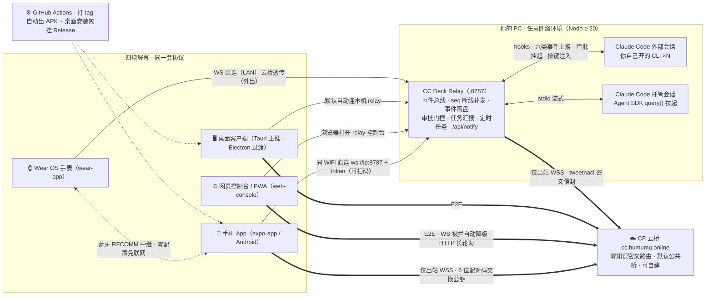

# CC Deck

[](https://github.com/humumu130/cc-deck/actions/workflows/relay.yml)
[](https://github.com/humumu130/cc-deck/actions/workflows/android.yml)
[](https://github.com/humumu130/cc-deck/actions/workflows/desktop.yml)
[](https://github.com/humumu130/cc-deck/releases/latest)
[](./LICENSE)

在手机上使用 PC 端的 Claude Code：查看会话状态、批准权限、发送消息、切换模型、接收任务汇报。自建 relay，不经过任何第三方云服务；不在同一网络时走 Cloudflare 中继，端到端加密。

[🏠 项目主页](https://cc-deck.humumu.online/) · [网页控制台](https://cc-deck.humumu.online/app) · [下载最新版](https://github.com/humumu130/cc-deck/releases/latest) · [直链下载页](https://cc-deck.humumu.online/download/)

<!-- TODO(截图占位)：三端三联图，源图在内部归档不随仓库发布，补拍后放 docs/screenshots/ 替换
     1. 手机 App：会话列表（源徽章 + ctx 水位条）+ 设置抽屉
     2. 网页 / 桌面：会话页（转录时间线 + 模型下拉锚定弹层）+ 设置抽屉竖排菜单
     3. 手表：会话速览卡 / 径向菜单 -->

## 目录

- [功能](#功能)
- [快速开始](#快速开始)
- [架构](#架构)
- [安全模型](#安全模型)
- [进阶](#进阶)
- [开发](#开发)
- [Roadmap](#roadmap)

## 功能

**随身掌控**

- 多会话实时同步，四态徽标（运行中 / 等待输入 / 出错 / 完成），断线自动补发
- 权限审批推到手机点 Allow / Reject；AskUserQuestion 提问远程点选；随时打断
- 给会话发消息、传图片（App 支持语音输入）；历史会话可续聊
- 模型远程切换：下拉即切当前会话模型（注入 CLI 原生 `/model`），ctx 水位行内嵌当前模型，App / 网页 / 桌面三端一致

**替你盯着**

- 任务完成主动汇报：悬浮框（可拖动、位置记忆）+ App 通知 + 手表震动，点按直达任务
- 待确认事项黄色悬浮框 + `/api/notify` 注入接口：任何脚本都能把一条消息推到你手机上（用法见[进阶](#进阶)）
- 上下文水位三端同口径分级色条，会话还能跑多久一眼可见；上下文压缩（Compacting）进行中三端明示，不再误判"卡死"
- 完整转录（工具调用 / diff / 思考过程），`#NNN` 任务号点击弹气泡速览详情
- 任务清单可拖动排序：手机 / 网页长按拖动调整优先级，CLI 按新顺序执行
- 定时任务随身可查：cron 表达式自动译成人话（"每天 08:00"），点开看完整指令；过期的一次性任务自动滤除

**多源多端**

- Android App、Wear OS 手表、网页 / PWA、Windows 桌面客户端（Tauri 主推 3.4MB）
- 多台 PC 可聚合同屏（opt-in），卡片角标区分来源；新建会话可选发往哪台（记住上次选择）
- 同一台 PC 多通道自动归并：LAN 与云桥两条连接按公钥派生的设备 id 密码学合并；127.0.0.1 / 主机名 / IP 等写法差异同样收敛为一条，不再裂出重复条目
- 跨网络经 6 位配对码接入云桥，全程密文，桥只见密文——在任何网络打开网页，输入家里 PC 领的 6 位码即连
- 三端在线更新：App 启动自动检查（镜像优先 + 断点续传 + 安装包完整性校验），桌面内建 updater 对接 GitHub Releases

**细节到位**

- 深色开发者工具风界面，App / 网页 / 桌面同一套设计语言
- 设置中心竖排菜单 + 卡片分区（连接 / Relay / 显示 / 关于）：Relay 状态、扫码配对、本机领码、添加手机收拢一页
- 会话列表三档密度（标准 / 紧凑 / 极简）、源徽章按来源着色，信息密度自己调

<details>
<summary>四端能力矩阵</summary>

| 能力 | 📱 手机 App | ⌚ 手表 | 🌐 网页 / PWA | 🖥️ 桌面客户端 |
|---|---|---|---|---|
| 会话列表 · 四态速览 | ✅ | ✅ 抬腕速览 | ✅ | ✅ 同网页 |
| 远程审批 · Ask 作答 | ✅ | ✅ 允许 / 拒绝 / 点选 | ✅ | ✅ |
| 发消息 · 图片 | ✅ 语音 + 相册 | — | ✅ 粘贴截图 | ✅ |
| 模型远程切换 | ✅ 水位行下拉 | — | ✅ | ✅ |
| 打断 / 停止 / 删除 | ✅ | ✅ 停止 | ✅ 删除带撤销 | ✅ |
| 任务清单 + 完成汇报 | ✅ 通知 | ✅ 轻震直达 | ✅ | ✅ |
| 上下文水位 / 定时任务 | ✅ | ✅ ctx 百分比 | ✅ | ✅ |
| 转录时间线 | ✅ 全量 | ✅ 压缩版 | ✅ 全量 | ✅ |
| 多源聚合（默认关） | ✅ | — 跟随手机 | ✅ | ✅ |
| 历史会话恢复 / 续聊 | ✅ | — | ✅ | ✅ |

</details>

## 快速开始

### 第 0 步 · PC 上装插件（两条命令）

```bash
claude plugin marketplace add humumu130/cc-deck
claude plugin install cc-deck@cc-deck-plugins
```

装好重启 Claude Code，在任意会话里执行 `/cc-deck`：后台启动 relay，终端打出三张二维码（App 下载 / App 直连 / 网页控制台）。插件自带的 hooks 会自动桥接**新开的** Claude Code 会话；已运行的会话需重开。数据目录 `~/.cc-deck/data/`，与插件升级解耦。

配套命令：`/cc-deck-pair` 领 6 位云桥配对码（5 分钟内有效、一次性），`/cc-deck-stop` 停止后台 relay。

### 场景 A · 同一网络（局域网）

- **手机 App**：[Releases](https://github.com/humumu130/cc-deck/releases) 或[直链下载页](https://cc.humumu.online/dl/)下载 APK 安装，「新增服务器 → 扫码添加」扫 `/cc-deck` 的 App 直连码，零手输；装好后 App 内即可检查更新
- **浏览器**：桌面浏览器打开时会自动嗅探本机 relay（`127.0.0.1:8787`），命中即零配置直连；或扫控制台码 / 直接打开 `http://<PC-IP>:8787/?token=…`
- **桌面**：下载 `CC-Deck-Setup-<tag>.exe`，启动自动连本机。未签名 exe 首次运行会触发 SmartScreen，选「更多信息 → 仍要运行」

### 场景 B · 跨网络（外出 / 异地）

1. PC 保持 relay 运行，执行 `/cc-deck-pair` 领 6 位配对码（PC 只发出站连接，无需公网 IP）
2. 手机 App「新增服务器 → 配对码」输码；或任意浏览器打开 <https://cc.humumu.online> 输码（PWA 可加主屏）
3. 所在网络拦截 WSS 时，网页端自动降级 HTTP 长轮询保持在线

<details>
<summary>更多姿势（手动跑 relay / 手表 / 平台说明）</summary>

- **手动跑 relay**：`cd relay && npm install && npm run dev`；要桥接自己开的 CLI 会话再执行 `node scripts/install-hooks.mjs`；领配对码 `npx tsx src/index.ts --pair`
- **Wear OS 手表**：`wear-app/` 构建安装。经手机蓝牙 RFCOMM 中继零配置接入（手表免联网、免录入，无 GMS 设备可用）；也支持 WS 直连 relay，或在手表设置粘贴云桥地址远程使用
- **平台**：Windows / macOS / Linux 均可跑 relay；「向外部 CLI 会话注入按键」依赖 Windows 专属注入器，其他平台外部会话为只读监控 + 审批，托管会话全功能可用

</details>

## 架构



- 细箭头 `→`：局域网 / 本机通道，token 鉴权，仅限可信局域网
- 粗箭头 `⇒`：云桥端到端密文通道——桥只按公钥派生的设备 id 路由，无法解密、不落盘
- 详细模块图 / 数据流时序 / 持久化机制见 [docs/architecture.md](docs/architecture.md)

## 安全模型

- **LAN token 是共享秘密**：拿到 token 即可完全控制你的会话。token 首启随机生成，请经安全渠道传递；换发删 `data/token` 重启或设 `CCR_TOKEN`
- **局域网直连无 TLS**：token 出现在 URL / WebSocket 参数中，仅限可信局域网；跨公网走云桥
- **云通道端到端加密**：手机与 relay 各持 tweetnacl box 密钥，桥上流转的全是密文信封 `{n,c}`
- **更新链路完整性**：App 下载更新包先校验结构完整性（防截断包进安装器），版本以 GitHub Releases 为源，镜像仅作分发
- **默认公共桥由作者运营**（带连接数 / 设备数 / 帧率限流）：能防窃听，但桥运营方理论上可观测元数据。介意者按[进阶](#进阶)4 条命令自建

## 进阶

<details>
<summary>通知注入（/api/notify）</summary>

把任意脚本 / cron / CI 的消息推到手机与网页的悬浮框。LAN token 鉴权；不指定 `session_id` 时自动投递给当前运行的会话（无则最新外部会话）。

```bash
# 绿色「任务完成」悬浮框（done 最多 10 条）
curl -X POST "http://127.0.0.1:8787/api/notify?token=<TOKEN>" \
  -H "content-type: application/json" \
  -d '{"done":["部署完成","冒烟全绿"]}'

# 黄色「待确认」悬浮框（text ≤120 字，点按直达会话）
curl -X POST "http://127.0.0.1:8787/api/notify?token=<TOKEN>" \
  -H "content-type: application/json" \
  -d '{"mode":"confirm","text":"发布包已就绪，等你确认"}'
```

</details>

<details>
<summary>环境变量（relay）</summary>

| 变量 | 默认 | 说明 |
|---|---|---|
| `CCR_PORT` | `8787` | 监听端口 |
| `CCR_TOKEN` | `data/token` 文件 | 鉴权 token；设环境变量（≥8 位）可覆盖 |
| `CCR_CWD` | 用户主目录 | 托管新建会话的缺省工作目录 |
| `CCR_MODEL` | `ANTHROPIC_DEFAULT_SONNET_MODEL` | 托管会话模型；不用默认值时请显式指定 |
| `CCR_DEBUG` | – | 打印 CLI stderr 与工具原始结构 |
| `CCR_GATE_TOOLS` | `Bash,Edit,Write,NotebookEdit,WebFetch,WebSearch` | 远程审批门控的工具名 |
| `CCR_BRIDGE_TOKEN` | `data/bridge-token` 文件 | hooks 回连 relay 的桥接令牌 |
| `CCR_DATA_DIR` | 插件 `~/.cc-deck/data` / 开发 `relay/data` | 数据目录 |
| `CCR_CLOUD_URL` | `wss://cc.humumu.online/cloud` | 云桥地址，逗号分隔可多桥；**空串禁用** |
| `CCR_CLOUD_TOKEN` | `ccdeck-public-9f3k2m7v` | 云桥层连接 token（自建桥换自己的） |

</details>

<details>
<summary>自建云桥（两种形态，协议相同）</summary>

云桥是无状态密文路由：客户端帧 `{to, data}` 按设备 id 点对点转发，无持久化无缓冲。

| 形态 | 目录 | 适合 |
|---|---|---|
| Node + ws（Docker 就绪） | `cloud-bridge/` | 有 VPS / 内网服务器 |
| Cloudflare Worker + Durable Object | `cloudflare/` | 不想维护服务器，空闲不计费 |

```bash
# Cloudflare Worker（4 条命令）
cd cloudflare
npx wrangler login
npx wrangler secret put CLOUD_TOKEN    # 设 ≥8 位随机串
# 编辑 wrangler.toml：改 name，routes 换成自己的域名（或删掉用默认 workers.dev）
npx wrangler deploy
```

```bash
# Node / Docker
docker build -t cc-cloud-bridge ./cloud-bridge
docker run -d -p 8790:8790 -e CLOUD_TOKEN=<8位以上随机串> cc-cloud-bridge
```

部署后 relay 侧设 `CCR_CLOUD_URL` 与 `CCR_CLOUD_TOKEN` 指向它，手机重新配对一次。

</details>

## 开发

<details>
<summary>构建与测试命令</summary>

```bash
# relay（Node ≥ 20）
cd relay && npm install
npm run dev             # 前台跑 relay
npm run test:bus        # EventBus seq / 环形缓冲 / 断线补发
npm run test:sessions   # 双会话并发全生命周期
npm run test:ws         # WS 鉴权 / 快照 / 补发 / 幂等
npm run test:history    # 历史持久化与重启恢复
npm run test:bridge     # hooks 桥接外部会话 / 远程审批 / 超时
npm run test:cloud      # 云通道端到端
npx tsx scripts/smoke-e2e.ts <token>  # 浏览器等价全流程

# 手机端（Expo 57 / React Native 0.86）
cd expo-app && npm install && npx expo run:android

# 手表端（Kotlin + wear-compose）
cd wear-app && ./gradlew assembleDebug

# 桌面客户端
cd desktop && npm install && npm run dist        # Electron
cd desktop-tauri && npx tauri build              # Tauri

# 从源码重建插件
cd relay && node scripts/build-plugin.mjs
```

**版本号单一事实源**：根目录 `VERSION` 文件。发版只改它，再跑 `node scripts/version.mjs --write` 同步到四个落点（web-console `CONSOLE_VERSION`、expo-app `app.json` 与 `build.gradle`、desktop-tauri `package.json`）；`--check` 由 git pre-commit 钩子强制校验，不同步的提交直接拦截。

```bash
node scripts/version.mjs           # 查看各落点当前值
node scripts/version.mjs --write   # 发版：把 VERSION 写入全部落点
node scripts/version.mjs --check   # 校验（pre-commit 自动跑）
```

</details>

仓库布局：`relay/`（核心，协议唯一定义源 `relay/src/types.ts`）、`web-console/`（网页控制台）、`expo-app/`（Android 手机端 + 手表网关）、`wear-app/`（Wear OS 手表端）、`desktop-tauri/`（桌面客户端主推）与 `desktop/`（Electron，过渡期保留）、`cloud-bridge/` 与 `cloudflare/`（云桥双形态）、`mobile/`（APK 分发页）、`cc-plugins/`（Claude Code 插件成品）、`docs/`（架构文档）。

## Roadmap

- v0.3.32（待发布）：网页空态提示居中、「关于」页内置下载入口
- 手表 Tiles（不开 App 直接看状态）
- 更多手表平台：OPPO ColorOS Watch 适配进行中
- 多手机 / 多设备同时在线
- LAN 直连 WSS / TLS 部署加固

## License

[MIT](LICENSE) © humumu130
