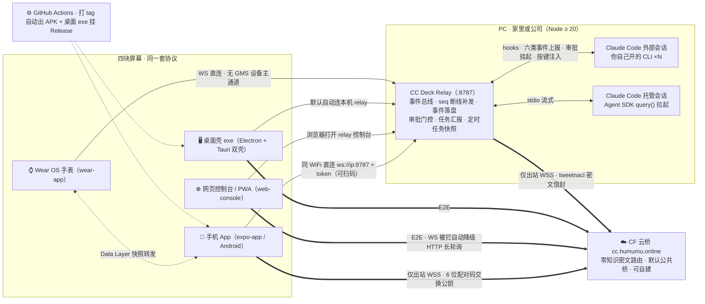

# CC Deck

**Claude Code 的随身指挥台**：把 PC 上的编码会话变成在任何屏幕上随时可查、可批、可派活的任务运行时。它不止是"远程查看与控制"——权限审批推到手机上点、任务完成主动汇报、上下文水位抬腕可见、转录结构化可回溯、定时任务随身查，这层**工作流增强**才是核心。自建 relay，不依赖任何官方远程服务；跨网络经 Cloudflare 云桥中继，tweetnacl 端到端加密，桥只见密文。

[](https://github.com/humumu130/cc-deck/actions/workflows/relay.yml)
[](https://github.com/humumu130/cc-deck/actions/workflows/android.yml)
[](https://github.com/humumu130/cc-deck/actions/workflows/desktop.yml)
[](https://github.com/humumu130/cc-deck/releases/latest)
[](./LICENSE)

模型不绑定：relay 会话走你现有的 `claude` CLI 配置（作者日常挂智谱 GLM），任何 Anthropic 兼容端点都能跑。

## 功能亮点

### 随身掌控 —— 把终端装进口袋

- **多会话实时同步**：四态徽标（运行中 / 等待输入 / 出错 / 完成），断线自动重连并按 seq 补发错过的事件；事件落盘持久化，relay 重启后历史会话照常恢复
- **审批远程化**：Bash / Edit / Write 等工具调用挂起等你 Allow / Reject（工具清单可配，最长约 10 分钟后回落 CLI 本地流程）；AskUserQuestion 的提问实时推到手机远程点选；随时远程打断 / 停止
- **消息与图片注入**：直接给会话发消息——App 支持语音输入与相册传图，网页支持粘贴截图；会话忙时自动排队、空闲送入；历史会话可续聊恢复

### 工作流增强 —— 不止"看"，替你盯着

- **任务管理 + 完成汇报**：TodoWrite 的任务清单结构化下发（进度条 / 逐项状态 / 转录里 `#NNN` 任务号点击跳转 / 待确认项横幅），任务完成**主动推报**——App 悬浮钮 + 系统通知，手表轻震 + 点按直达
- **上下文水位**：每会话 context 用量分级色条（<60% 绿 / <85% 黄 / ≥85% 红），马拉松会话"还能跑多久"一眼可见，手机 / 手表 / 网页三端同口径
- **转录结构化**：时间线完整转录工具调用、diff、思考过程，跨天分隔；并行子 Agent 单独成卡，各自带状态与摘要
- **定时任务**：会话 `.claude/scheduled_tasks.json` 的排程快照下发到各端，"下一班什么时候跑"随身可查

### 多源多端 —— 一套协议，四块屏幕

- **四端客户端**：Android App（扫码直连）、Wear OS 手表（抬腕速览 + 轻操作，无 GMS 国行表可用）、网页控制台 / PWA、Windows 桌面 exe 壳（Electron 与 Tauri 双壳共存）；多台 PC 的 relay 可聚合同屏（opt-in，默认单源）
- **跨网络可达**：PC 与手机都只发出站连接（公司网络友好）；外出时 6 位配对码经云桥接入，端到端加密

## 架构



- **细箭头 `→`**：局域网 / 本机通道，token 鉴权明文，仅限可信局域网
- **粗箭头 `⇒`**：云桥端到端密文通道——桥只按公钥派生的设备 id 路由，无法解密、不落盘
- **虚线**：CI 产物下发 / 手机向手表转发快照
- **Claude Code 双接入**：你自己开的 CLI 会话经 hooks 桥接（六类事件上报 + 审批挂起 + 按键注入）；relay 自己拉起的托管会话走 Agent SDK streaming，全功能可用

模块图 / 数据流时序 / 持久化与可靠性机制见 [docs/architecture.md](docs/architecture.md)。

## 快速开始

### 第 0 步 · PC 上装好插件（两条命令）

```bash
claude plugin marketplace add humumu130/cc-deck
claude plugin install cc-deck@cc-deck-plugins
```

装好重启 Claude Code，在任意会话里执行 `/cc-deck`：后台启动 relay + 终端打出二维码（App 下载码 / App 直连码 / 网页控制台码）。数据目录 `~/.cc-deck/data/`（token、日志、事件历史），与插件升级 / 卸载解耦。配套命令：`/cc-deck-pair` 领 6 位云桥配对码（20 分钟内有效、一次性），`/cc-deck-stop` 停止后台 relay。

插件自带的 hooks 会自动把**新开的** Claude Code 会话桥接进来（含远程审批）；已运行的会话需新开后才接入。

### 场景 A · 家里：手机和 PC 同一个 WiFi

- **手机 App**：在 [Releases](https://github.com/humumu130/cc-deck/releases) 下载 `CC-Deck-<tag>.apk` 安装，「新增服务器」页点「扫码添加」，扫 `/cc-deck` 打出的「App 直连」码——地址与令牌自动填好，零手输
- **任何浏览器**：扫控制台码，或直接打开 `http://<PC-IP>:8787/?token=…`（二维码里带 token）
- **桌面**：Releases 下载 `CC-Deck-Setup-<tag>.exe`（或 portable zip），启动自动探测并连上本机 relay

### 场景 B · 公司：PC 在家、人在公司

- 家里 PC 保持插件 relay 运行，执行 `/cc-deck-pair` 领 6 位配对码（PC 只发出站连接，无需公网可达）
- 公司设备接入：手机 App「新增服务器 → 配对码」输码；或任意浏览器打开 <https://cc.humumu.online> 输码（PWA 可加主屏当轻 App 用）
- 全程端到端加密，桥只见密文；公司网络做 TLS 解密、拦掉 WSS 时，**网页端自动降级 HTTP 长轮询**保持在线（App 端目前仅 WS）

### 更多姿势

- **手动跑 relay**（读源码 / 改代码）：`cd relay && npm install && npm run dev`，首启自动生成 token 并打印控制台地址；要让手动跑的 relay 桥接你自己开的 CLI 会话，再执行 `node scripts/install-hooks.mjs`（六类事件 hook 幂等写入 `~/.claude/settings.json`，首次自动备份）；领配对码用 `npx tsx src/index.ts --pair`，只打出二维码用 `--qr`
- **Wear OS 手表**：`wear-app/` 构建安装，WebSocket 直连 relay（无 GMS 国行手表的主通道），或经手机 App 的 Data Layer 网关转发快照
- **平台说明**：Windows / macOS / Linux 均可跑 relay；仅「向外部 CLI 会话注入按键」（发消息 / 打断）依赖 Windows 专属注入器，其他平台上外部会话为只读监控 + 审批，托管会话全功能可用

## 安全模型（请务必阅读）

- **LAN token 是共享秘密**：任何拿到 token 的人都能完全控制你的 Claude Code 会话（读代码、发消息、批权限）。token 首启随机生成（非弱默认值），请经安全渠道传递；换发删 `data/token` 重启，或直接设 `CCR_TOKEN`。
- **局域网直连无 TLS**：token 出现在 URL / WebSocket 查询参数中，仅限可信局域网使用；跨公网请走云桥。
- **云通道端到端加密**：手机与 relay 各持一对 tweetnacl box 密钥，配对时经可信 LAN 信道交换公钥；桥上流转的全是密文信封 `{n,c}`，桥既解不开、也不落盘，设备 id 由公钥派生、互不可见。
- **默认公共桥由作者运营**（`wss://cc.humumu.online/cloud`，公开 token 仅做准入，带连接数 / 设备数 / 帧率限流）：能防第三方窃听（E2E），但桥运营方理论上可做元数据观测与断连。介意者 4 条命令自建：

```bash
cd cloudflare
npx wrangler login                     # 一次浏览器授权
npx wrangler secret put CLOUD_TOKEN    # 设 ≥8 位随机串（私有 token）
# 编辑 wrangler.toml：改 name，routes 换成自己的域名（或删掉 routes 用默认 workers.dev）
npx wrangler deploy
```

部署后得到 `wss://<你的桥>/cloud`，relay 侧设 `CCR_CLOUD_URL` 与 `CCR_CLOUD_TOKEN` 指向它，手机重新配对一次即可。

## 四端能力矩阵

| 能力 | 📱 手机 App | ⌚ 手表 | 🌐 网页 / PWA | 🖥️ 桌面壳 |
|---|---|---|---|---|
| 会话列表 · 四态速览 | ✅ | ✅ 抬腕会话卡 + 总览 | ✅ | ✅ 同网页 |
| 远程审批 · Ask 作答 | ✅ | ✅ 允许 / 拒绝 / 选项点选 | ✅ | ✅ |
| 发消息 · 图片 | ✅ 语音 + 相册传图 | —（无输入手段） | ✅ 粘贴截图 | ✅ |
| 打断 / 停止 / 删除 | ✅ | ✅ 停止；删除带二次确认 | ✅ 删除带 4s 撤销 | ✅ |
| 任务清单 + 完成汇报 | ✅ 悬浮钮 + 通知 | ✅ 轻震通知直达 | ✅ 任务号点击跳转 | ✅ |
| 上下文水位 | ✅ 分级色条 | ✅ ctx 百分比 | ✅ | ✅ |
| 定时任务排程 | ✅ | ✅ 只读速览卡 | ✅ | ✅ |
| 转录时间线 | ✅ 全量 + 折叠 | ✅ 压缩速览版 | ✅ 全量 | ✅ |
| 多源聚合（默认关） | ✅ | — 跟随手机 | ✅ | ✅ |
| 历史会话恢复 / 续聊 | ✅ | — | ✅ | ✅ |
| 接入通道 | LAN 直连（扫码）/ 云桥 | WS 直连 / 经手机网关 | LAN / 云桥（WS 被拦降级 HTTP 轮询） | 本机自动探测 / LAN / 云桥 |

手表端功能取舍按「抬腕时需不需要立刻知道 / 立刻点」分级维护，判定基准见 [docs/watch-feature-scope.md](docs/watch-feature-scope.md)。

## 进阶

### 环境变量（relay）

| 变量 | 默认 | 说明 |
|---|---|---|
| `CCR_PORT` | `8787` | 监听端口 |
| `CCR_TOKEN` | `data/token` 文件（首启生成、持久化） | 鉴权 token；设环境变量（≥8 位）可覆盖 |
| `CCR_CWD` | 用户主目录 | 托管新建会话的缺省工作目录 |
| `CCR_MODEL` | `ANTHROPIC_DEFAULT_SONNET_MODEL`，再缺省 `glm-5.3` | 托管会话模型；不用 GLM 时请显式指定 |
| `CCR_DEBUG` | – | 打印 CLI stderr 与工具原始结构 |
| `CCR_GATE_TOOLS` | `Bash,Edit,Write,NotebookEdit,WebFetch,WebSearch` | 远程审批门控的工具名（逗号分隔） |
| `CCR_BRIDGE_TOKEN` | `data/bridge-token` 文件 | hooks 回连 relay 的桥接令牌 |
| `CCR_DATA_DIR` | 插件 `~/.cc-deck/data` / 开发 `relay/data` | 数据目录 |
| `CCR_CLOUD_URL` | `wss://cc.humumu.online/cloud` | 云桥地址，逗号分隔可多桥并行；**空串禁用云桥** |
| `CCR_CLOUD_TOKEN` | `ccdeck-public-9f3k2m7v` | 云桥层连接 token（公共桥为公开 token；自建桥换成自己的） |

### 自建云桥（两种形态，协议相同）

云桥是无状态密文路由：客户端帧 `{to, data}`，按设备 id 点对点转发，无持久化无缓冲，断线补发复用 relay 的 seq 机制。

| 形态 | 目录 | 适合 |
|---|---|---|
| Node + ws（Docker 就绪） | `cloud-bridge/` | 有 VPS / 内网服务器 |
| Cloudflare Worker + Durable Object | `cloudflare/` | 不想维护服务器，空闲不计费 |

```bash
# Node / Docker
docker build -t cc-cloud-bridge ./cloud-bridge
docker run -d -p 8790:8790 -e CLOUD_TOKEN=<8位以上随机串> cc-cloud-bridge
```

本地裸跑：`cd cloud-bridge && npm install && npm run dev`（默认 `:8790`，`CLOUD_PORT` / `CLOUD_EXTRA_PORT` 可调）。Cloudflare Worker 见上文 4 条命令；本地验证 `npm run test:cloud`。自建后中继地址形如 `wss://<你的桥>/cloud`（Worker 原生 TLS）；workers.dev 域名在部分网络可达性一般，绑自定义域可改善。

## 开发指南

```bash
# relay（Node ≥ 20）
cd relay && npm install
npm run dev             # 前台跑 relay
npm run test:bus        # EventBus seq / 环形缓冲 / 断线补发
npm run test:sessions   # 双会话并发全生命周期（含远程审批、diff 统计）
npm run test:ws         # WS 鉴权 / 快照 / 补发 / 幂等
npm run test:history    # 历史持久化与重启恢复
npm run test:bridge     # hooks 桥接外部会话 / 远程审批 / 超时
npm run test:cloud      # 云通道端到端：配对 / 密文收发 / 断线补发
npx tsx scripts/smoke-e2e.ts <token>  # 对运行中的 server 走浏览器等价全流程

# 手机端（Expo 57 / React Native 0.86，需 Android 环境）
cd expo-app && npm install && npx expo run:android

# 手表端（Kotlin + wear-compose）
cd wear-app && ./gradlew assembleDebug     # Windows: gradlew.bat assembleDebug

# 桌面壳
cd desktop && npm install && npm run dist        # Electron（产物在 desktop/dist/）
cd desktop-tauri && npx tauri build              # Tauri 平行壳

# 从源码重建插件（bundle relay 单文件 + 汇集静态资源到 cc-plugins/plugins/cc-deck/）
cd relay && node scripts/build-plugin.mjs
```

仓库布局：`relay/`（核心，协议唯一定义源 `relay/src/types.ts`）、`web-console/`（网页控制台）、`expo-app/`（Android 手机端 + 手表网关）、`wear-app/`（Wear OS 手表端）、`desktop/` 与 `desktop-tauri/`（桌面双壳，复用 web-console）、`cloud-bridge/` 与 `cloudflare/`（云桥双形态）、`mobile/`（APK 分发页）、`cc-plugins/`（Claude Code 插件成品）、`docs/` 与 `design/`（设计文档与技术评审）。

未签名 exe 首次运行会触发 SmartScreen 提示，选「更多信息 → 仍要运行」即可。

## Roadmap

- 手表 Tiles（不开 App 直接看状态）
- 多手机 / 多设备同时在线
- iOS / macOS：PWA 路线（调研已完结，见 [docs/ios-mac-research.md](docs/ios-mac-research.md)）
- LAN 直连 WSS / TLS 部署加固

## 相关文档

- [docs/architecture.md](docs/architecture.md) — 全链路架构：模块图 / 数据流时序 / 持久化与可靠性
- [docs/watch-feature-scope.md](docs/watch-feature-scope.md) — 手表端功能域定义与 A/B/C 取舍分级
- [docs/feature-parity-web.md](docs/feature-parity-web.md) — 网页端功能对齐清单
- [docs/aggregate-mode-design.md](docs/aggregate-mode-design.md) — App 多源聚合模式设计
- [docs/desktop-decision.md](docs/desktop-decision.md) — 桌面壳选型决策（Electron vs Tauri vs WebView2）
- [docs/ios-mac-research.md](docs/ios-mac-research.md) — iOS / macOS 支持可行性调研
- [网页控制台公网镜像](https://cc.humumu.online) · [Releases 下载](https://github.com/humumu130/cc-deck/releases/latest)

## License

[MIT](LICENSE) © humumu130
