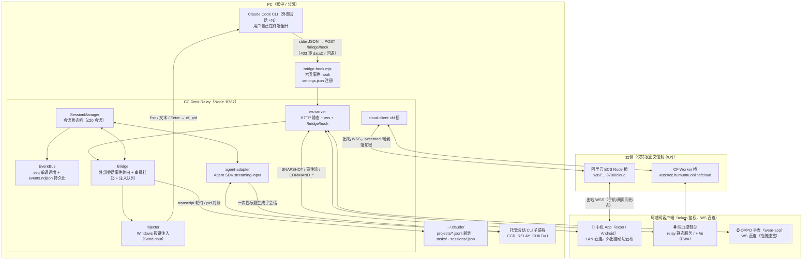
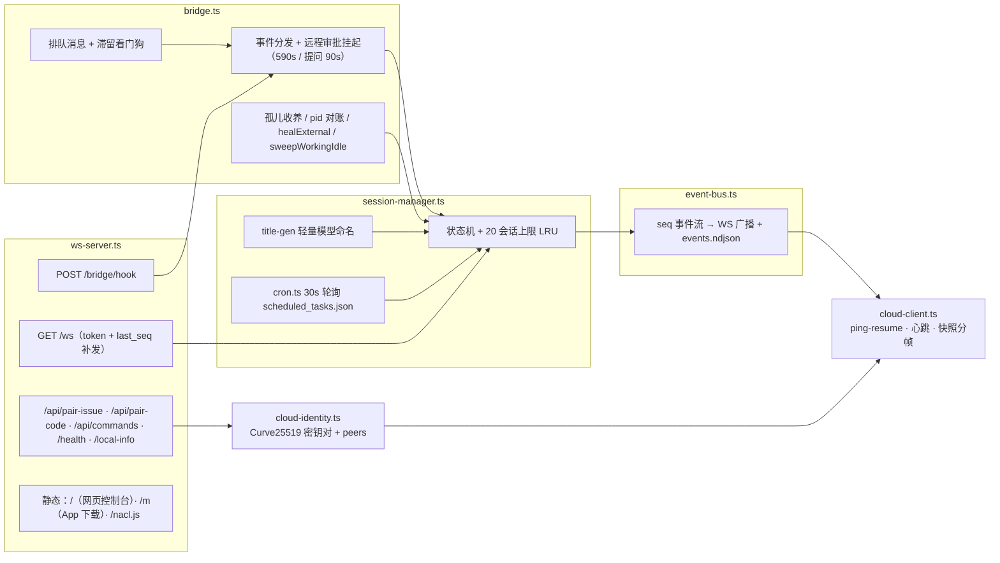
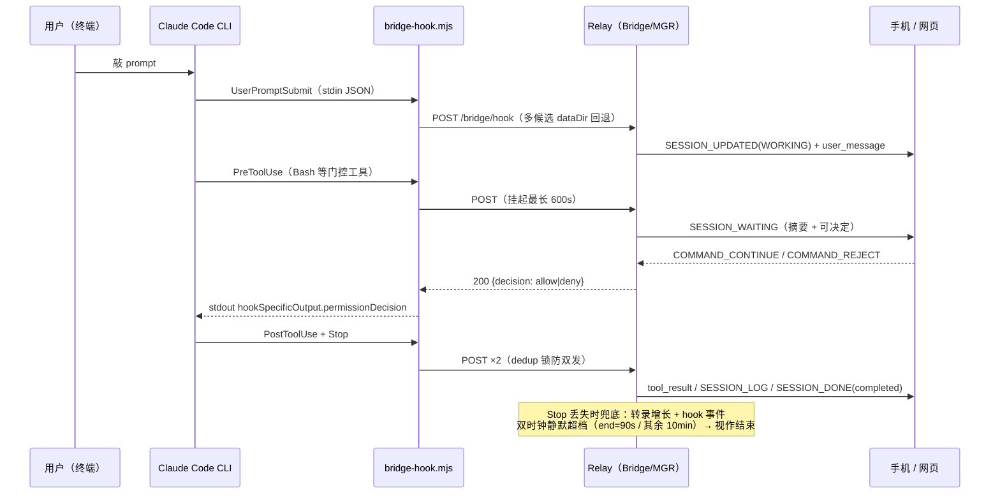
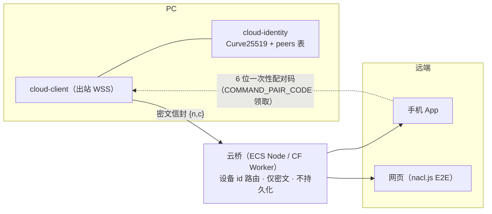

# CC Deck 架构

全链路视图：PC 侧 relay 是唯一中枢，手机 / 手表 / 网页三类客户端经 LAN 直连或云桥接入；Claude Code 会话分**外部会话**（用户自己开的 CLI，hooks 桥接）与**托管会话**（relay 经 Agent SDK 拉起）两条接入路径。

## 1. 总览拓扑

要点：

- **hook 只上报不控制**：外部会话的事件（UserPromptSubmit / PreToolUse / PostToolUse / Notification / Stop / SessionEnd）经回环 POST 进 relay；反向控制（发消息、打断）走 injector 向 CLI 进程注入按键，pid 由 hook 父链解析并缓存。
- **云桥零知识**：PC 与手机/网页都只发出站连接，帧为端到端密文信封，桥只按公钥派生的设备 id（`rl-…` / `ph-…`）路由，配对凭 6 位一次性码（20 分钟有效）。
- **手表是精简客户端**：只连 WS 收快照与审批，不注入；OPPO Watch 无 GMS，直连网络是唯一路径。

## 2. Relay 内部模块

状态机四态：`WORKING → WAITING →（DONE | ERROR）`；回合起点 `turn_started_at` 供客户端本地计时。`context_usage`（当回合水位）与 `context_limit`（按模型：glm-5.x=1M，其余 200k）由 relay 集中计算随状态下发，客户端不存映射表。

## 3. 外部会话一次回合（数据流）

反向控制：`COMMAND_EXT_INPUT → Bridge 注入队列 → injector 按键注入 cli_pid`；忙时排队、回合结束 flush；`COMMAND_EXT_STOP → Esc 注入`（乐观置 DONE，后续工具活动自动纠正回 WORKING）。

## 4. 托管会话（relay 拉起）

`COMMAND_CREATE → AgentSession（@anthropic-ai/claude-agent-sdk query streaming-input）→ CLI 子进程（CCR_RELAY_CHILD=1，hook 不上报防双注册）`。回合级 usage / todos / 流式块经 SDK feed 进同一条状态机；agent 死亡后 `COMMAND_MESSAGE` 触发 `resume(sdkId)` 原地复活，时间线保留。

## 5. 云桥链路（跨网络）

配对信任锚 = LAN token 或已配对设备签发；relay 侧 peers 表持久化在 `~/.cc-deck/data`（或 `relay/data`）。断线由 ping-resume + 收紧心跳自愈；快照超 1MB 分帧防踢链。

## 6. 持久化清单（data/ 目录）

| 文件 | 作用 | 恢复路径 |
|---|---|---|
| `events.ndjson` | 全量事件流（启动时 compact 压缩） | 重启重放收养历史会话（按 updated_at 活跃度收养 ≤20） |
| `bridge.json` | hook 上报用端口 + token | listen 成功后才写；dev 模式镜像到 `~/.cc-deck/data`（#211） |
| `cli-pids.json` | hook 侧 session_id→pid 缓存 | relay 重启后补水注入定位 |
| `child-sessions.json` | relay 自拉 SDK 子会话 id | 孤儿扫描排除，防误收养 |
| `deleted-ext.json` | 手机删过的外部会话墓碑 | 防孤儿扫描复活 |
| `todo-hidden.json` | 隐藏任务条目 normKey | setTodos 咽喉点统一过滤 |
| `token` / `bridge-token` | LAN / hook 鉴权 | 首启生成持久化 |
| `relay.pid` / `relay.log` | daemon 形态 | pid 由子进程 listen 成功后自写 |

外部事实源（CLI 写、relay 读）：`~/.claude/projects/*/*.jsonl`（转录：assistant 文本 / usage / 子 Agent / 排队台账）、`~/.claude/tasks/<sid>/*.json`（任务清单权威源）、`~/.claude/sessions/<pid>.json`（会话名 + pid 对账）、`<cwd>/.claude/scheduled_tasks.json`（定时任务）。

## 7. 可靠性机制

| 机制 | 兜住的问题 |
|---|---|
| hook 多候选回退 + bridge.json 换班镜像 | relay 换班持端口时 token 失配 → 403 丢事件（#211） |
| sweepWorkingIdle 双时钟空闲判定 | Stop 上报整体失联 → 永久假 WORKING |
| healExternal / reconcilePidsFromSessions | relay 重启误标 ERROR、pid 缓存断档 |
| 孤儿收养（30min 活跃 + 多回合判定） | CLI 早于插件启动，无 hook 事件不可见 |
| last_seq 补发 + SNAPSHOT | 断线重连不丢事件；>1MB 快照分帧 |
| Esc 乐观 DONE + 事后纠正 | Esc 打断不触发 Stop hook |
| 排队消息滞留看门狗（补发 Enter） | 注入回车被 CLI 界面层吞掉 |
