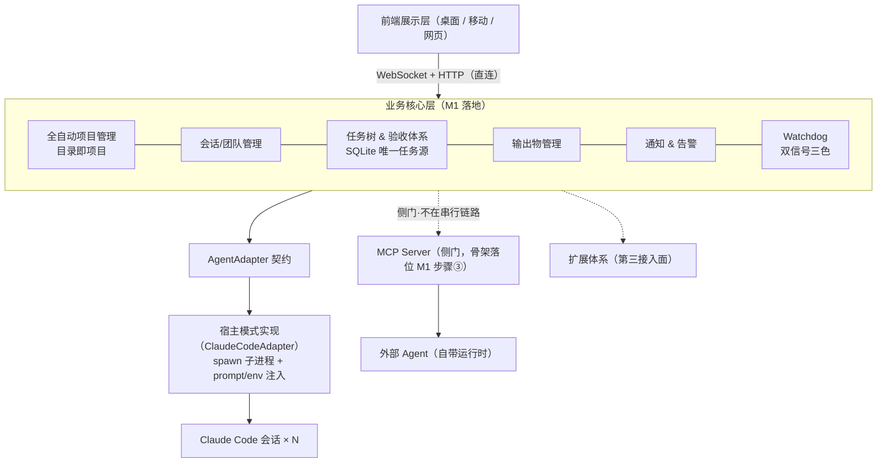
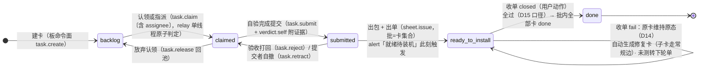

# cc-deck V2 系统设计 0.8 —— Agent 无关编排层

> 版本 0.8（2026-09-23）。0.2 = 三 Agent 审查修订（acceptance_result 第三表、回填闭环重接五态机、message-id 锚、板命令面、锚迁移、M1 排序压实）；0.3 = 扩展体系节；0.4 = 命名拍板（扩展 Extension / 分发型插件更名 cc-deck-relay）+ 原生生态兼容层（skill 先行、MCP 托管进规范）；0.5 = 存量审计三报告反哺（详见 `docs/v2-legacy-audit.md`）：心跳物理来源声明、回放路径下线、文件态全景清单、事件语义协议迁移、端上缓存细则、扩展注册表、呈现纪律；0.6 = 图纸化：§二 分层图 Mermaid 化、§六 补验收闭环状态机图；**配套架构图 `docs/v2-architecture-diagrams.html`（整体架构 + 内部架构双图，预览版）**；0.7 = 第二轮三视角复审（一致性/工程可行性/产品走查）反哺：**直播侧消息 id 换源（D9 前提修正）**、**session 表运行态与文件态落位补全（回放下线兜底成立的前提）**、自验两段式（D13）、修复卡细则（D14）、命令面扩表与转移矩阵、接替触发权裁定、MCP 门面写面白名单、HISTORY 分块契约、§十一 在途冲突面七条对策、决策日志补 D11-D14；0.8 = 第三轮三视角复审（审 0.7 增量全文）反哺：**单会话验收裁定（D15：判定效力两分支——出单=认可表达、一键收单=闸口）**、**修复轮批收口（D14 扩：批=卡集合、收单作用域=批内全部卡、叶子豁免、克隆范围与快照去重、closed 后改判=修 result+触发修复卡不回转卡态）**、**命令面身份模型（D16：per-session token + sheet 凭证分离 + 归属校验）**、D11 锚精确化为 message.id（user 消息无 id 口径）、对账豁免改内容标记主案、接替限流域与母文档对齐+失联卡不回池、超窗判定帧并入 SNAPSHOT、PARTIAL 索引语法修正、leader 指派/提交者自撤补命令、O10/O11。**编号注记**：文中 M4/M5/M7/M8 = 复审编号（非里程碑 M1-M3），S 系 = 产品走查，H/L/E = 工程复审，C 系 = 与 #131 冲突面。状态：**打磨中，未定稿**；定稿后并入 `docs/team-mode-design.md` 战略修订节，本文件转归档。
> 红线继承：本文一切设计不得违反 `team-mode-design.md` 已实证条款（五态机、用户在环闸口、认领原子性、消息真相在 transcript、relay 零依赖单进程、内部数据不入开源仓库）。

## 一、定位与战略

cc-deck 从「Claude Code 专属控制台」升级为 **Agent 无关的多 Agent 编排平台（控制面）**：

- 编排核心只依赖 **AgentAdapter 抽象契约**，不绑定任何 Agent 实现细节
- M1 仅实现 `ClaudeCodeAdapter` 一个实现类；新增 Agent = 新增适配器，编排核心零改动
- 接入双模式（**分开定义，不混在同一套 Adapter 里**；控制面自身对第三方的能力扩展点为**第三接入面**，见十二）：
  1. **宿主模式**：cc-deck 作为宿主主动 spawn Agent 进程（Claude Code 属此类），管控其生命周期
  2. **MCP 门面模式**：外部 Agent 自带运行时、主动调用 cc-deck 能力——**独立侧门，不在前端访问业务核心的串行链路上**。**M1 门面=只读工具集**（看板 / 看卡 / artifact 读）；写面白名单原则：**`verdict.self` 永不对门面开放**——收单「全过」口径下 self pass + 用户一键收单 = done，无差别代理命令面等于把部分 done 权交给外部 Agent；其余写命令是否开放、外部 Agent 会话落位与生命周期信号 → 开放问题 O9
- 两种边界纪律：① 接口先行、实现唯一——第二个真实接入需求出现前不写空头适配器；② 契约从「编排需要什么」出发，不从「Claude Code 有什么」出发（防特性泄漏：TaskList、hooks 等是 CC 实现细节，不进契约签名）

## 二、总体分层（修正版）



完整双图（含用户/多端/云桥的宏观视图与六层内部视图）见 `docs/v2-architecture-diagrams.html`。事件总线（events.ndjson 广播管道）归数据层双轨（见五），图中不重复画。

与 V1.1 分层图的差异：MCP Server 从「前端↔业务核心串行层」改为**侧门**；多 Agent 适配层明确为契约+宿主实现，不是数据通路层。

## 三、AgentAdapter 契约（六能力）

| 能力 | 内容 | CC 实现要点 |
|---|---|---|
| 1 生命周期 | spawn / resume / kill；**resume 失败降级链 = 接替**（新会话 + 硬路注入未完卡 + 锚迁移，见七） | SDK query()；spawn-record 支持重启重建 |
| 2 指令下发 | 结构化消息（含 taskRef） | prompt 注入；env 注入身份（CCR_TEAM_*） |
| 3 事件归一 | lifecycle / log / status / task 四类统一事件 | SESSION_HEARTBEAT/SESSION_LOG 映射 |
| 4 任务双向同步 | **声明式能力**：`hasNativeTasks: bool` | true=CC（文件+hook 双向）；false=仅系统卡投影 |
| 5 健康监控 | 心跳 / 业务日志双信号，**信号集可声明，且必须声明心跳物理来源**（托管=childPid 探活/流信号；外部=hook 到达+pid 探活——现 SESSION_HEARTBEAT 是 relay 定时器假心跳，流断照跳，不得当活性信号） | 缺信号时三色退化为两色（活着/死了） |
| 6 历史回读 | getHistory(session, **range 以消息 id 表达**) 分页 | 读 transcript，从文件尾反向按块扫描（见八）；无 transcript 的 Agent 用事件流滚动窗口兜底（量级受压缩上限约束，仅近期）。**前置改造：直播侧 LogEntry.id 换源为 message.id（API 消息 id）**——直播侧拿不到 transcript 顶层 uuid，唯一可换源的是 message.id（工程复审 0.8 实测精确化，见八 / D11） |

## 四、项目域

- **目录即项目**：会话 cwd **取 `realpath()` 归一化后**的绝对路径 = 唯指纹（防 /var↔/private/var、symlink 家目录产生同库异径重复项目）；静默创建/匹配 Project；默认目录统一收敛 `default_project`（防零散聚合）
- **worktree 特例**：团队会话跑在 `../cc-deck-wt/<member>` 时，项目归属**继承开团时锚定的主仓库指纹**（session 表 `anchor_project_id` 列，spawn 时写入），**跳过 cwd 推导**——防团队被拆成多个假项目（表级落地见六）
- **导航口径**：rail 新增【项目】一级入口 = **聚合只读视图**（列表 → 单项目详情）；💬/👥 原入口保留不动；💬 会话列表加项目分组。多面板并行打开 = M2 候选（守 v6 导航地基的单焦点切换语义）。豁免说明：「升格即搬家不留双入口」判据管可编辑面；只读聚合视图不产生双写者，豁免成立；**guard：M2 若项目域看板变可写，双写面问题回归，须重新过判据**。与 team-mode v7+「项目一等化 A（rail 不动）/ B（视使用升格）」的关系：A 以项目尚无数据域为前提，V2 数据层落地后项目即一等实体，rail 入口是其唯一自然呈现面——**开放问题 O10（deadline M1③ 动工前）**，随 v7+ 拍板联动确认（M1③ 项目域 rail 入口的去留直接等它）
- **开团锚定**：开团动作**显式选项目**（开团表单必选，或 leader 建议/编制确认时锚定）——team 表 project_id 必填外键的写入点。手机开团无 cwd 上下文，**不允许静默落 default_project**（否则整个团被逐出项目域聚合视图）
- **M1 轻管理**：右键改名（只改 name，不动指纹）+ IDEA 式移除（`is_hidden` 仅隐藏，可开关恢复）；不做物理删除/迁移/归档

## 五、数据层总纲

- **SQLite（better-sqlite3 单文件嵌入式）= 实体状态唯一真相**，库文件落 `~/.cc-deck/data/cc-deck.db`（不入开源仓库，随数据目录备份）。前置理由：Agent 无关化必须有自有任务模型（部分 Agent 无任务概念）；嵌入式不属于服务型数据库，不违反「永不上服务型 DB」铁律。工程注记：better-sqlite3 为 native 依赖，桌面端打包需随平台出产物（electron-tauri 各有先例），「零依赖单进程」形态的代价在此一次性交代
- **双轨职责线**：SQLite 答当前态，events.ndjson 答广播与审计。纪律：**mutation 先写库、后 emit 事件；事件只带增量引用，不携带全量状态**。消息真相在 transcript；events.ndjson 里的消息相关事件仅为广播与审计摘要，不构成第二真相
- **事件语义协议迁移（M1①/M1③ 三端联动，审计 A）**：现状 emitUpdated 每帧摊 ~15 字段全量状态、三端按「增量帧≈全量刷新」消费——DB 切换时事件须同步从「状态快照帧」改为「实体引用增量」（实体 id + 变更字段），排期不得只算 relay 侧
- **前置必改（现存缺陷，独立于 V2 也需修，共四项；0.7 按工程复审补注记）**：
  ① `compactEvents` 只保会话状态+日志两桶，新事件类型重启即被静默清空——分桶修复仅服务**过渡期双读**，且是**三件套**：桶结构 + 每桶 kept 上限 + `reduceHistory` 配套 case（闭世界 switch 无 case 仍丢弃，保而不放 = 白改）；**无 sid 事件（notification/task 类）单独全局桶**，不进「假会话桶」参与会话数裁剪
  ② EventBus 初始化 seq 取**压缩前**文件末行 seq 与 kept 末条的 max，根治 seq 回退——尾部被裁事件有两类：心跳 **与 SESSION_DELETED 整组丢弃**（history.ts:43-45 同样裁掉全局最大 seq 行）；实现取**最后可解析行**的 seq（损坏尾行逐行 try-catch 跳过后不可取物理末行）
  ③ **SESSION_HEARTBEAT 改 emitTransient**（一行级）。归因修正（0.7 实测）：心跳字节占活跃期 ndjson 仅 ~1.3%（SESSION_LOG 占 70%）——「无界增长主源」成立于**空闲挂机时段**（WORKING 会话空闲时唯一落盘源，5s/跳 ≈91KB/h/会话）与 **seq 回退最常见触发源**两个维度；两端消费方（expo store / web-console 的 elapsed_hint case）**零渲染依赖**，改后无用户可见影响，M1① 顺手删两端死 case
  ④ **回放重建路径 M1① 落库后整体下线**——reduceHistory 是闭世界 switch（未知类型 `default: break` 静默丢），为新事件类型扩桶 = 为旧脊柱再造第二套 reducer，与「SQLite 答当前态」二律背反。**下线兜底（0.7 补，回放现在恢复而表必须接住的）**：SessionState 运行态字段 usage / context_usage / context_limit / stats / todos / subagents / cron_tasks / pending_inputs / remote_mode 由 session 表 **`runtime_state_json`** 承接（#72 水位跨重启还原是修过的实弹 bug，不落位即回归）；#82/#52 重启矫正状态机（ERROR 无 error 归 DONE、pid 探活、resume 锚点归 DONE）迁移到写库路径——两者均列 M1① 迁移脚本验收点（工程复审 0.8 注：矫正的 pid 数据源 = cli-pids.json，留文件态但须补消费者注记，见下文件态清单）；**已知损失明示追加**：system 日志行（已允许/已拒绝/错误:/完成: 摘要——非消息、不进 transcript、消息不入库，下线后跨重启 UI 不可恢复，审计流仍有）。~~终态摘要~~（0.8 撤销损失：done_reason/duration_ms/last_error 并入 `runtime_state_json?` 零成本——终态写库后不再变，活列有落位即无损失）
- **删除分界**（防膨胀）：逻辑删除（`deleted_at` 列，仅制度记忆实体：project、系统卡、acceptance_sheet、artifact 登记）；**投影类物理删**（agent_native 子卡收团归档时清）；notification：info/warn 留 30 天物理删，**alert 常驻不删**（关闭=置 read 态，不属于逻辑删除类）。膨胀源（消息、投影步骤）已被「消息不入库 + 投影物理删」两刀切除，年增量 MB 级
- **存量迁移**（forward-only，不提供回退；上线后**双读一个版本周期**——DB 有则用 DB、无则回落文件）：
  - deliverables.json、acceptances/*.json 搬表（artifact 文件不挪窝，表存 path 指过去）；events.ndjson 历史保留只读；**results.json 多轮历史同 events.ndjson 待遇——只读归档，表只灌最后一轮**（判定真相=表，逐轮历史=审计流，防「搬表后原文件删除」误读）
  - **文件态全景清单**（审计 A：散落 ≥12 处，逐项定归宿，不许悬空；0.7 逐项标注落点）：入库——deliverables→**artifact 表**；acceptances/*→**acceptance_sheet + result 行**（历史单的 item/result 行归宿视 O8）；title-overrides（#53 注释自证权威）→**session.title_override?**；pinned-sessions→**session.pinned_at?**；child-sessions→**session.parent_sid?**；deleted-ext→**session.agent_type + status**（ext- 剥除两列化的另一半）；todo-hidden→**session.todo_hidden_json?**；回放恢复的运行态→**session.runtime_state_json?**（见前置必改④）；spawn-record→**session.spawn_record_json?**（收库，M1② 接替依赖——见六）；明示留文件态——config.json、token/bridge.json/cloud-*（凭据非业务态）、cli-pids（可确定性重建的派生索引；**#82 矫正状态机的 pid 探活消费者**，迁移后仍从这里读）、last-cwd/relay-name（进程配置）
  - **已知损失明示**：deliverables 老 sid 无 SESSION_CREATED 可查 → project_id 落 default_project；acceptances 真老单无会话字段 → issued_by_session 置空（**#138 起新单有 cwd 盖章，可按 cwd→项目指纹回填，损失面远小于老单**）；历史 sheet 的 rows.task 自由文本**不强行挂靠**，原文迁入 snapshot_json；artifacts 目录无登记记录的手放文件 → project_id 兜底 default_project；sid 双态归一——桥接 `ext-` 前缀**剥除** → agent_type + claude_sid 两列
  - 指纹归一化预演：迁移前先跑 realpath 归一演练（同指纹多条即合并演练），确认无重复项目再动数据

## 六、表设计（融合定稿）

> 通用约定：自增 id 主键；业务表带 project_id 外键；created_at/updated_at 时间戳；枚举列一律带 `CHECK (col IN (...))`；**制度记忆实体（project、task、acceptance_sheet、artifact 登记）带 `deleted_at?`**（五节删除分界的落点）；索引随建表（清单见本节末）；**建表脚本必须 `PRAGMA foreign_keys = ON`**（better-sqlite3 默认 OFF，外键约定才真实生效）+ **`PRAGMA journal_mode = WAL`、`synchronous = NORMAL`**（单写者高频 UPDATE runtime_state_json 的写放大实测不劣于现状 events.ndjson 同步落盘，WAL 保读不阻塞——工程复审 0.8）；task.artifact_id ↔ artifact.task_id 互指——**两行先建（各自可空）、事务内回填**，禁互等（better-sqlite3 `.transaction()` 同步执行，回填时两行已在，成立）。

### task（核心）

| 字段 | 说明 |
|---|---|
| id / project_id / **team_id→（可空）** / session_id→(可空) | 归属；CHECK **必须显式写 `team_id IS NOT NULL OR session_id IS NOT NULL`**（SQLite 对含 NULL 的 CHECK 表达式走 NULL-through 放行，「至少一项非空」不显式写即形同虚设——工程复审 L1）。**session_id 语义 = 当前归属会话，非创建会话**（S2-5）：团队卡经 assignee_id→team_member.agent_instance_id 链闭环；单会话卡无 member 中介，**接替时随锚迁移一并更新 session_id**——否则新会话按自身 sid 查卡得 0 张，接替链断 |
| parent_task_id→(null=顶层) · **origin[system\|agent_native]** | 两种父子边共用列。**origin 判定路径**：① 经板命令面（见七）创建 = system；② **relay 编排副作用创建（收单 fail 自动生成修复卡、改判触发修复卡）= system**（D14）；③ Agent 会话内私自 TaskCreate、经对账发现的 = agent_native（折叠展示，收团物理删；单会话模式无收团动作，挂**会话 removed 态连带清理**）。单会话模式 agent 经命令面建主卡 → 合法 system |
| **external_sid + external_task_file_id（复合唯一）** | CC 侧锚结构化两列（取代拼串 external_ref——对账高频查询「某 sid 下哪些文件 id 已挂卡」需要索引，拼串退化成 LIKE 前缀）。**接替/重建 = relay 编排动作，流程内含锚迁移**：旧 sid 未完 agent_native 卡批量重锚到新 sid，不依赖 CC 自觉 |
| task_ref UNIQUE | 下发 payload 携带的引用标识 |
| title · description · scope_json · handoff | scope=文件域（派工互斥）；handoff=接替换人自包含说明 |
| assignee_id→team_member(可空) · branch(可空) · artifact_id→(可空) · deleted_at? | 编排字段（deleted_at=制度记忆实体落点，五节删除分界） |
| **status[backlog\|claimed\|submitted\|ready_to_install\|done]** | 五态机（blocked 为 M2 预留态）。四态简化已拒——D1。**父卡状态 = 子卡聚合派生，读时计算不落列**（单写者下无一致性成本；避免批量翻转子卡时逐行广播中间态）。**修复轮规则（D14/S1-2，0.8 收口）**：fail 打回时**原卡维持 ready_to_install，不回 claimed**——修复卡是原卡的子卡，若原卡回 claimed，「父卡=子卡聚合派生」与「原卡自身状态」两条腿互相打架；「修复中」= 派生展示态（存在未 done 修复卡时显示，**原卡同时移出看板「就绪待装机」组或降饱和标「修复中，暂缓装机」**——防用户装到带 bug 旧包），非第六态。**终态收口（0.8）**：sheet.close 全过的作用域 = **批内全部卡**（原卡+修复卡一并 done，见 sheet 批定义）——原卡不再需要自己的单；**closed 后改判**：仅改 result 记录 + 触发生成修复卡（用户动作=改判本身，复用 D14 事务），**卡态不回转**（done 无出边维持，矩阵不变） |

### acceptance_item（验收项 = 纯定义 + 活工作态）

| 字段 | 说明 |
|---|---|
| id · task_id→（NOT NULL，必须是 origin=system 的叶子——父卡不直接挂项。**唯一豁免（0.8，工程复审洞1）**：挂 item 的卡允许携带**修复卡类型**子卡（D14 生成），修复卡全 done 后原卡恢复叶子身份——否则「原卡挂 item」与「修复卡挂原卡下」自相矛盾） · seq | 验收点定义，随任务活维护 |
| content | 验收标准（单一动作 + 可观察结果） |
| **self_verdict?[pass\|fail\|untestable] · self_evidence? · by_session?** | **活工作态**（D13 第一段）：随 `verdict.self` 提交即更新，回答「这一项现在过没过」；每轮历史判定在 result 表——sheet 未出单时 self 也有落点（S1-1 的解）。**写者限定 = 卡归属者（worker / 单会话 agent）——0.8 裁定**：verifier **不写活列**（其认可 = 出单动作本身、其 fail = task.reject 原因留痕），杜绝双写者互相覆盖（产品 F3：worker 后写冲掉 verifier 复核，D8 防的覆盖在活列上回归）。活列恒可写（open 期重自验继续更新，下轮 issue 仍从它搬运），**搬运后不清空**——活列答「现在」，result 首行答「出单时点」，两处同值是正确状态非双真相；展示层：卡视图取活列，单据视图取 result |
| **derived_from_item_id?→acceptance_item** | 修复卡克隆来源（D14）：收单 fail 生成修复卡时，新卡 item 从原 item 克隆并指回——验收标准的演化链可审计 |

**判定记录不挂本表**（D8 措辞随 D13 精确化）：被拒的是**历史判定记录**挂列——同一 item 进多轮 sheet，轮次 verdict 挂列会被下一轮覆盖、审计断链，判定记录落 result 表。**活工作态列合法**：它是当前值不是历史，result 首行由它搬运而来（见下），不构成第二真相。

### acceptance_result（验收判定 = 每轮 sheet × item 一行）

| 字段 | 说明 |
|---|---|
| id · **sheet_id→ · item_id→（复合唯一）** · ts | 一轮装机批次对一个验收项的判定 |
| **self_verdict** [pass\|fail\|untestable\|null] + self_evidence + by_session | **自验层（D13 第二段）**：`verdict.self` 先写 item 活工作态（写者=卡归属者，见上），**sheet.issue 事务内搬运生成 result 首行**——两段闭合；附证据与写入会话（可审计）。**「全过」判定的 self 效力（0.8 改写，D15）——不设 verifier.self 列，效力来自出单动作**：团队模式 = user_verdict pass，或（item 活列 self=pass **且出单由非归属者完成**——出单即 verifier 对自验的认可表达）；**单会话模式 = user_verdict pass，或（agent self=pass 且用户一键收单）**——agent 兼任验收位，防自验自判的替代闸门 = D1 收单闸口本身。被拒：verifier.self 独立列（活列双写者互覆盖，F3） |
| **user_verdict** [pass\|fail\|null] | **终验层：仅用户可写**（在线表单/装机反馈，凭证见 D16）。Agent 永远写不进此列——防篡改的准确边界。closed 后用户仍可改判（同权限边界）：改判仅更新 result 记录 + fail 改判触发生成修复卡（用户动作=改判，复用 D14 事务），**卡态不回转**（done 无出边维持——0.8 裁定，消解「幂等重算」与转移矩阵的矛盾） |

### acceptance_sheet（验收单 = 一次装机批次的快照）

| 字段 | 说明 |
|---|---|
| id(32hex，不可枚举) · project_id · title · version(如 0.6.0-test.18) | 对应一个 test 包。**安全口径 0.8 改写（D16，v0「id 即凭证」作废）**：id 仅作**路由**不作凭证——fill/close 须**用户侧端凭证**（已配对端身份，LAN 配对 token / 云桥端身份）；防的洞：单会话出单者=agent 必然持有 id，若 id 即凭证则 agent 可 issue+fill+close 一手包办打穿 D1（产品 F5）。保留：60s/10 次限流、64KB body 校验、同源无 CORS |
| issued_by_session · status[open\|filled\|closed] · task_ids_json | 出单→回填→闭环。**closed 仅用户动作触发**（与 user_verdict 同权限边界）；open 期可反复重提（result upsert + 审计事件）。**批定义（0.8，产品 F8）**：`task_ids_json` = 本单覆盖的卡集合——一次装机批次一张单，**含原卡及其未 done 修复卡**（修复轮的 item 经克隆挂修复卡、与原卡未测 item 同单呈现） |
| snapshot_json | 出单时把批内卡 item 定义**全量拍扁**（行组按端分节：手机/桌面/网页）+ 出单时点的 self_verdict。**未测续拍判据（S2-2，0.8 精确化）**：**未测 = 无 user_verdict 且无「经出单认可的 self pass」（D15 口径）**——凡未测 item 必入下轮快照（以判定缺失为准，不依赖上轮 sheet 是否仍可读）；fail 行的 item 已有终验**不再入快照**，其重验由修复卡克隆 item 在同批承载（防同一标准两行）；续拍行在快照内标注来源。**表单渲染层按模式过滤**：单会话只渲染 fail/未验行，全 pass 行只读展示「AI 代验」——快照恒全量（审计可信），渲染可裁剪 |

### 卡状态 × sheet 生命周期对照（对齐 team-mode 五态机）

| 时点 | 触发者 | 卡状态 | sheet |
|---|---|---|---|
| 认领 / 指派 | worker 自领（`task.claim`）；leader 指派（`task.claim` 带 assignee 参数，0.8 补——母文档 backlog→claimed 双入口的另一半） | backlog → claimed | — |
| 开发完成自验提交 | 卡归属者（`task.submit`） | claimed → submitted | — |
| 验收打回（出单前） | 验收会话/verifier/用户（`task.reject`，**原因必填**） | submitted → claimed | — |
| 提交者自撤 | 提交者本人（`task.retract`，0.8 补——提交后发现问题的低成本回头路，省一轮验收） | submitted → claimed | — |
| 放弃认领 | 卡归属者（`task.release`） | claimed → backlog（回池） | — |
| **出包 + 出单**（同一动作） | 验收会话/leader（团队）；agent（单会话），经命令面 `sheet.issue`（payload=批内卡集合） | submitted → **ready_to_install**；alert「就绪待装机」此刻触发 | open |
| 用户装机回填 | 用户（表单，`sheet.fill`，端凭证）；**提交成功页直接给「确认收单」按钮**（fill→close 同屏两步，0.8 补——防用户不知道还差一步） | 维持 ready_to_install | open → filled |
| **收单 closed**（用户动作，即装机确认闸口，`sheet.close`） | 用户 | 全过（判定效力 D15：user_verdict pass，或「活列 self=pass 且出单由非归属者完成」〔团队〕/「agent self=pass」〔单会话，闸门=本次一键收单〕）→ **批内全部卡 done**（原卡+修复卡，0.8 收口）；fail 行 → 原卡**维持 ready_to_install**（D14，不回 claimed）+ 自动生成修复卡挂原卡下（origin=system，默认 assignee=原归属者）+ 原因写**修复卡 description 首行**（原卡定义不污染）+ 通知归属会话；未测行 → 转「下轮单」（未测判据见 sheet 表） | closed |
| closed 后改判（0.8 新增行） | 用户 | 卡态**不回转**：仅更新 result 记录；改判为 fail → 触发生成修复卡（用户动作=改判，复用 D14 事务），原卡维持 done 直到修复轮再走完 | closed（不改） |

- 「永不自动 done」的**自动** = 无用户动作的流转（D1 修订措辞）。收单是用户动作——全 AI 代验 pass 的单会话模式，用户也须**一键收单确认**（闸口从「填表」降为「一键」，仍不自动）。与 v0 #125/#138 实跑语义（回填全 ✓ → 任务闭环）**对齐而非冲突**
- team-mode 原文卡内 `accept[]` 内联 schema **被本节 item/result 行表取代**；board.json **被 task 表取代**（原文数据层以 V2 为准，流程语义照旧继承——**五态机 0.7/0.8 修订点共两处**：① fail 收单原卡不回 claimed（D14，取消原文 ready_to_install→claimed 用户反馈边，改维持原态+修复卡）② 收单全过作用域=批内全部卡；此外均照旧）。**母文档 leader 循环「成员心跳超时→卡回 backlog」与自动接替的消解（0.8）**：自动接替域内失联卡**不回池**（随锚迁移给接替者继续 claimed），仅接替彻底失败才由 leader/relay 回池——两套逻辑并行必撞（产品 F13）

验收闭环状态机（对照表的可视化）：



### 其余六表（机械合并，无争议）

```
project(id, name, dir_fingerprint UNIQUE, is_default, is_hidden, deleted_at?, ts)
session(id, project_id→, claude_sid【稳定身份】,
        title_override?(用户改名——title-overrides.json 落点，#53 的权威归位；无覆盖时显示名由消息摘要派生，不落列),
        session_cwd, agent_type, is_team_session,
        team_id?(可空——收团连带清理按此关联),
        anchor_project_id?(可空——worktree 会话存锚定项目，跳过 cwd 推导),
        parent_sid?(可空——child-sessions.json 落点，桥接/子会话挂母会话),
        pinned_at?(可空——pinned-sessions.json 落点),
        todo_hidden_json?(todo 折叠态——todo-hidden.json 落点),
        runtime_state_json?(运行态承接位：usage/context 水位/stats/todos/subagents/cron_tasks/
                           pending_inputs/remote_mode——回放下线后这些字段的唯一落点，
                           #72 水位跨重启还原依赖此列，见五前置必改④),
        spawn_record_json?(接替/重启重建所需；spawn-record 文件降级为引导缓存，真相在库),
        status[live|idle|working|waiting|error|done|removed]
               （含 removed 态——deleted-ext.json 落点：ext- 前缀剥除后由 agent_type+status 两列承接；
                 waiting=等用户输入，承接回放现有等待态——全集此处定型，M1① 建 CHECK 用）,
        worktree_path?, ts)
team(id, project_id→(NOT NULL——§四开团锚定的写入点，显式标注), name, status[active|archived], ts)
team_member(id, team_id→, role[leader|worker|verifier|researcher],
        agent_instance_id(=当前活跃 session.id 引用，接替时原子更新；历次会话经 session.team_id 反查),
        model_route, worktree_branch, last_heartbeat, last_business_log_at,
        status[干活中|滞留|失联]——不用 online，防「只看心跳」实现倒退, ts)
artifact(id, project_id→, session_id→, task_id?, path, size, kind[deliverable|sheet|report], deleted_at?, ts)
        ← deliverables.json 搬家；挂 project 不挂 sid（根治归因 bug）
        ← kind=sheet 行由出单动作生成，path 指向出单源文件（md——实践已收敛：出单 md 本就写进 artifacts/），与 acceptance_sheet.id 一一对应
notification(id, project_id?, session_id?, level[info|warn|alert], category,
        payload_json, read_at?, ts)
```

**索引清单**：task(project_id,status)、task(parent_task_id)、task(team_id,status)、**task(session_id)（单会话卡按 sid 直查——L1 补）**、task(external_sid,external_task_file_id) UNIQUE、acceptance_item(task_id,seq)、acceptance_item(derived_from_item_id)（溯源查询）、acceptance_result(sheet_id,item_id) UNIQUE、session(claude_sid) UNIQUE、artifact(project_id)、notification 索引（**partial index 无 PARTIAL 关键字，WHERE 子句本身即 partial——0.8 实测修正，照 0.7 字面写 DDL 直接语法错误**）：`CREATE INDEX idx_notif_unread ON notification(read_at) WHERE read_at IS NULL`、`CREATE INDEX idx_notif_alert ON notification(level) WHERE read_at IS NULL AND level='alert'`（重连 alert 补发查询，见八/九）。

**被拒：Message 表**（决策日志 D2）——消息真相在 transcript；events.ndjson 仅承载广播与审计摘要，入库 = 第二真相（体积/同步/漂移三宗罪）。

## 七、任务链路（表 ↔ Agent）

**板命令面（写路径唯一）**：一切任务/验收状态变更经 relay API（S2-1/M7 补全命令集，原 `task.state` 语义过载拆废）。Agent 走 loopback HTTP 调用，用户/前端走同一 API 面；**relay 单线程即原子性来源**（认领=读改写同 tick）。Agent 直写库不存在（多写者破坏单写者纪律，D10）；Agent 会话内私自 TaskCreate 不经命令面 → 对账挂 agent_native。这同时解决单会话模式建卡主体：agent 经命令面建卡，origin=system。

**身份模型（0.8 新增，D16——权限表的执行基础；0.7 版权限表只有名单没有身份，等于没设）**：① **agent 凭证 = spawn 时签发的 per-session token**（env 注入，loopback 调用必带），relay 按凭证把调用归属到 session——归属不清的调用一律拒；② **用户凭证 = 端配对身份**（LAN 配对 token / 云桥端身份），用户通道天然可调全命令；③ 现状过渡注记：deliver 脚本 agent 侧直读 LAN token（=宿主全部权限，#131 盘点已发现）——M1② 命令面落地时切换，切换前 LAN token 视同用户通道。**归属校验**：`release / submit / retract / verdict.self` 仅卡归属会话可调（防错乱/幻觉 agent 替别人提交——认领原子性只护了 claim 一条边，其余写路径同护）；用户/leader 豁免。

**命令全集与权限**：

| 命令 | 可调方 | 语义 |
|---|---|---|
| `task.create` | agent / 用户 | 建卡；payload 可内嵌 `items[]` 验收点定义一并入库 |
| `task.claim` / `task.release` | agent（claim 带 `assignee?` 参数时 = leader 指派，0.8 补——母文档 backlog→claimed 双入口）/ 卡归属者 | 认领/指派 / 放弃认领回池（claimed→backlog） |
| `task.submit` | 卡归属者 | 自验完成提交，payload 携带 verdict.self 增量 |
| `task.retract` | 提交者本人（0.8 补） | submitted→claimed 自撤——提交后发现问题的低成本回头路，省一轮验收 |
| `task.reject(reason)` | 验收会话/verifier/用户 | 打回 submitted→claimed，**reason 必填**（红线：打回必附原因） |
| `task.move` | 用户 | 手动重排/移树——取代 TodoWrite prompt 注入（呈现纪律，见十③） |
| `sheet.issue` | 验收会话/leader（团队）；agent（单会话） | 出包+出单；payload=**批内卡集合**（原卡+未 done 修复卡）；**全动作单事务**（0.8 明示：sheet 行 + snapshot 拍扁 + result 搬运 + 卡翻 ready_to_install + alert 插入同一事务，防「sheet open 但卡未 ready」中间态被广播）；事务内搬运 item 活工作态生成 result 首行（D13） |
| `sheet.fill` | **仅用户**（表单通道，端凭证——id 仅路由，D16） | 回填 user_verdict；agent 凭证调用即拒；MCP 门面不暴露（见一/O9） |
| `sheet.close` | **仅用户**（端凭证） | 收单闭环（装机确认闸口）：全过判定（D15）/ 修复卡生成 / 未测续拍 |
| `verdict.self` | 卡归属者（D15 写者限定） | 写 item 活工作态（D13 第一段）；**永不对 MCP 门面开放** |
| ~~`task.state`~~ | — | **拆废**：打回/重排语义混装，由 task.reject + task.move 取代 |

**状态转移矩阵**（命令面按此校验，非法转移即拒）：

| from ＼ to | backlog | claimed | submitted | ready_to_install | done |
|---|---|---|---|---|---|
| backlog | — | task.claim（含指派） | | | |
| claimed | task.release | — | task.submit | | |
| submitted | | task.reject / task.retract | — | sheet.issue | |
| ready_to_install | | | | — | sheet.close（全过→批内全部卡） |
| done | | | | | — |

修复轮不新增边（D14）：fail 收单时原卡**维持 ready_to_install**，修复卡是挂原卡下的新 backlog 卡走常规边——矩阵不变。**done 无出边**：closed 后改判不回转卡态（仅 result + 触发修复卡，见 acceptance_result 表）；「父卡=子卡聚合派生」不用于 done 判定（收单才是唯一终态闸口，D1）。

**三档同步机制**（2026-09-22 本机实验，部分验证）：

| 档 | 机制 | 用途 | 状态 |
|---|---|---|---|
| 主路 | 下发 prompt 带结构化 taskRef，成员自建任务挂靠 | 日常派卡（软约束） | 零风险 |
| 硬路 | **进程未启动时直写 `~/.claude/tasks/<sid>/<n>.json`**（实验：注入 → resume → TaskList 可见 ✅；schema：id/subject/description/activeForm/status/blocks/blockedBy） | 接替/重启重建：新会话开机自带未完卡 | 注入可见性已验证；**待补实验 E1**：CC 自身 TaskCreate 的 id 分配策略（计数器 or 目录扫描 max+1——本机对端会话 147 个 id 且持续增长，id 爬过注入值真实可达）；**E2**：运行中会话 turn 间隙是否重读目录。**豁免主案 = 内容标记（0.8 改，工程复审 M5）**：注入 json 写 `source:"cc-deck"` 字段（CC 自建 schema 不会带），对账按字段豁免——**不依赖 E1 结论、两种 id 分配制下都成立**；id 保留段（≥9000）降为辅助标记。被拒的纯 id 段方案：max+1 扫描制下注入文件长期存在 → max 恒 ≥9000 → CC 自建 id 恒落保留段 →「id≥9000=注入」误判全部自建卡 + 改号追不上（改到高位再推高 max、改到低位与 CC 并发写竞态）——结构性死循环。改号（保留段逼近迁移）仍为编排动作备用，须**同步改写任务 json 内 blocks/blockedBy 引用** |
| 对账 | **两级：PostToolUse hook = 尽力而为增量**（cc-plugins 待建，POST loopback，relay 侧按 file id+mtime 幂等去重）；**任务文件轮询 = 对账真相源**（#206 直读，活跃成员 10–30s 周期；**relay 启动完成即跑一轮全量对账**） | 检测成员自建 → 自动挂 agent_native 子节点 | hook 待建，轮询现成 |

- 标记一律放消息 payload（taskRef 字段），**不放 HTTP 头**（spawn 通道无头可带）
- **硬路注入 × 对账反噬（S2-6）**：对账轮询分不清「CC 自建」与「relay 注入」——注入卡会被误挂 agent_native 折叠层。豁免规则（0.8 主案）：**注入 json 带 `source:"cc-deck"` 字段即注入卡，对账跳过**；无标记且无 taskRef 挂靠的才是 agent_native 候选（id≥9000 为辅助判据）
- **单会话模式验收触发（S1-4）**：命令面解决「谁能建卡」，没解决「谁提醒建」——不引导则验收体系在单会话模式默认不发生。落点：spawn 注入验收流程引导 prompt（**全链：建卡 task.create→写验收点 items[]→认领 task.claim→自验 verdict.self→提交 task.submit→出单 sheet.issue**——0.8 补全 claim/submit 两环，0.7 链照做会被转移矩阵拒）；**引导做成可重放资产**（skill 形态，长会话中途新任务/桥接会话〔非 spawn 无注入点〕都能再触发——skill 本就是 agent facet 方向，第一批实践）
- 不硬禁成员自建任务（技术不可强制）——「标记纪律 + 对账兜底」组合达到等价效果
- CC 侧 tasklist 定位为**投影**：不管理验收项，无权写 user_verdict

## 八、消息与历史

- 对话消息**不入库**（D2）；历史 = **查询管道**：端上「上滑加载更早」→ **WS command 帧**（`COMMAND_HISTORY`，走既有 WebSocket 通道——局域网/云桥同路可达，不新开 HTTP 端口，出门场景也通）→ adapter.getHistory 读 transcript 分页。**响应分块（M4；0.8 措辞精确化）**：HISTORY 回包**单帧 ≤512KB**——复用 ARTIFACT_CHUNK 的**帧形态与定向投递通道**（帧序/512KB 上限/FULL_TEXT_CAP=10000 同款口径），**续传游标为新增逻辑**（ARTIFACT_CHUNK 现状缺帧即整包重推，无续传；HISTORY 源是反向块扫，天然游标=文件 offset/message-id，续传=带游标重扫，可行）——云桥 E2E 下单帧大包正是 #135 族同类病灶，历史帧不重蹈
- **锚 = (sid, message-id)**（D9；**0.8 指代精确化（工程复审实测）**：transcript 行有**两个 id**——顶层 uuid（每行唯一）与 **message.id**（`msg_` 前缀，同一 API 消息多行共享；本机 8 文件 21285 行 assistant 实测空值率 0）——**直播侧唯一可换源的是 message.id，顶层 uuid SDK 消息不带**；D11 的「消息 uuid」全文按 message.id 理解，若 getHistory 按顶层 uuid 返回则两源仍不相等。换源落点：SDK 路径取 assistant 终态 `message.id` + stream_event 加 `message_start` case 缓存流式消息 id（agent-adapter.ts:500-532 小改）；桥接路径 msgId 提取现成（bridge.ts:1661），换下发 logId 即可，增长链 `${sid}|${msgId}|${kind}` 原样保留。**user 消息 message.id=None（实测）**——直播 user 回显不参与 id 去重（标 transient 不进缓存流），历史合并按会话边界处理（0.8 明示的缺口）；**同 message.id 多行的折叠契约**：同 id 同 kind 合并展示（bridge 增长链已是现成先例）。**工具条目无消息 id**（bridge.ts:1820 不传，transcript 工具行的 message.id 数据存在）——传入 msgId 即并入所属消息块，或 `tool-` 前缀派生锚，M1③ 二选一定案。合成 id 降为无 message.id 条目的 fallback。被拒的 (sid,seq) 锚维持原判：transcript 无 seq，两空间对不上；压缩裁尾后失效）
- **性能铁律**（本机实测最大 transcript 343MB；0.7 措辞精确化——工程复审 L2）：**禁 O(文件) 读**——分页从文件尾向前按块（~256KB）反向扫完整 JSONL 行，O(页字节) 而非 O(文件)；**有界定位读（带 offset、≤512KB）sync/async 皆可**（与 better-sqlite3 同步哲学一致），**无界/未知长度扫描必须 async 流读**（单线程 relay 会被一次秒级整读卡死，全队冻住）；M1 只做**连续上翻**，砍「跳任意中间页」
- **两层缓存，角色分离，谁都不是存储层**：relay 侧 `history-cache/<sid>.jsonl` 滚动窗口（查询优化层，M1.5 可选，可丢可重建）；端上本地缓存最近几屏（UI 体验层，M1 做）——消息与 last_seq 游标绑定落盘。端上细则（审计 C）：**三端存储各选其道**——web 用 IndexedDB（localStorage 顶 5MB 上限且现状零使用）、RN 用文件+索引式（artifact 磁盘缓存的 LRU+防抖+启动恢复范式直接克隆；AsyncStorage 整块 JSON 卡 JS 线程，不用）；**定序契约：id 幂等去重为最终一致手段，游标仅优化**（消息成、游标未成可由重拉同 id 自愈，反之不可）——三端绑定顺序必须一致，否则孵新 #135 族；**SNAPSHOT 恒权威**，端上缓存只服务「上滑更早」与离线浏览，不与快照 merge；时间线 cap 从「静默丢头」改「记录被裁首条锚、可回源」
- **getHistory 契约补充（D9 收尾）**：返回的 message-id 必须**与直播事件 id 同一字面**（adapter 不得重新生成，否则端上按 id 去重失效变双条目）——D11 换源后直播与回读天然同源于 transcript 的 **message.id**（非顶层 uuid，见上），此条从纪律要求变为结构保证；端上接收铁律——一次在途 HISTORY 请求唯一（分块续传请求**接替**已断死的在途请求，非并发第二请求，两约束正交）+ 上滑防抖背压（云桥 E2E 下历史帧量大）
- **断连补洞（重连方向；0.7 补握手与 alert 补发——S2-7，0.8 挂载点精确化）**：重连时**先握手判定、后补数据**——端上携 last_seq，relay 判定缺口是否在事件流保留窗内（挂载点=三处重连分支 ws-server.ts:700-740 / cloud-client.ts:347-369/:659-676 同构）。**已超窗 → 判定信息并入 SNAPSHOT 帧发回**（附流内最早可用 seq——超窗时 SNAPSHOT 仍须发，会话列表也要重建；独立「判定帧」取代 SNAPSHOT 是实现错误，0.8 明示），端上转 `COMMAND_HISTORY` 从缓存的最后 message-id 向后拉齐再接直播。**保留窗真相（0.8 实测注记）**：重连判定用的是**内存环形缓冲（capacity=500）**而非压缩器文件窗——断连数分钟即走超窗分支，**COMMAND_HISTORY 拉齐是常态路径而非边缘路径**，M1③ 按主路打磨。**alert 补发面**：断连期间错过的 alert（失联/就绪待装机）由重连握手一并补发——notification 表 `read_at IS NULL AND level='alert'` 即查即发（「alert 常驻不删」的落点在此兑现；否则 alert 只在发生瞬间广播、断连即永久错过，与「需用户行动」语义矛盾；现状零基础——现有通知借 todos 通道无持久化，此件全新）。**M1 步骤③ 验收点：断连 ≥24h 重连无洞、无重复错序**（#135 族修复的完整判据，逐帧 try-catch 只是其中一环）

## 九、Watchdog 与通知

- Watchdog：双信号（心跳 + 最后业务日志）三色**干活中/滞留/失联**；不信端上在线状态；缺信号适配器声明降级两色。定级：滞留 → warn（可自愈）；失联 → alert
- **接替触发权（S2-3 裁定；0.8 与母文档逐条对齐——0.7 把「API 限流」整体划手动域与 team-mode:131「429/额度尽 → relay 按链试下一项，静默完成」字面冲突）**：① **链上还有下一项（429/额度尽/单 provider 故障）→ 自动回落**（母文档既定：换链上下一项，不同额度池不撞同一堵墙）；② **链走尽/厂商整体不可用 → 手动**（母文档:156 既定——换厂商需用户决策，自动接替只会孵化新会话继续撞墙）；③ **失联（非厂商原因）→ relay 自动接替**（resume → 新会话 + 硬路注入，防风暴上限兜底）。**判别规则（现状信号集区分不了「限流重试」与「真卡死」——同形；0.8 补）**：回合 ERROR 文本命中限流词表（rate limit/429/overloaded/quota/余额——词表实装前采双后端真实样本，见 O11）→ 手动域；watchdog 判僵死且无错误文本 → 自动域（判不了默认自动）。**卡处置（0.8，消解与母文档 leader 循环的撞车）**：自动接替域内失联卡**不回池**（随锚迁移给接替者继续 claimed），仅接替彻底失败才回池
- **失联通知分级（0.8，产品 F9）**：自动接替成功 → 发 warn/info「已失联并自动接替」（事后告知）；仅降级链走尽升级用户时才 alert——否则「需用户行动」通道塞满已被自动处理的事，狼来了，真升级被忽略
- **手动接替入口（0.8，产品 F10）**：手动域（厂商故障）的用户操作面 = 失联 alert 的行动项 + 成员卡「重试接替」（M1③ 呈现层落位——现状手机模型服务页只有换路由无重 spawn 入口）
- **重建窗口静默**：relay 启动后 grace 期（~90s）内不判失联、不升 alert——防热替换重启造成全员红牌告警风暴（对齐 team-mode 风险4 只防了审批风暴的缺口）
- 通知：info（短时）/ warn（10s）/ alert（**需用户行动的常驻通知，手动关闭**——就绪待装机为典型，另含失联、验收打回摘要）；持久落库、已读管理、点击跳转实体。**开放问题 O2：手机端触达形态**（推送/徽标 vs 收纳位置——设置页收纳已被质疑违反 alert 语义；sheet 到达手机的分发路径与在途 #137 badge 联动，见十一。实现约束入注：Android FGS 常驻通知位已被连接保活占用，alert 通知与之争同一通知位——O2 拍板须算进这个细节）

## 十、M1 排序（三步走，防大爆炸）

1. **数据地基**（以 O5 拍板为准）：SQLite + 全部表 + 索引 + realpath 指纹 + 存量迁移（含已知损失清单、双读过渡）；Adapter 契约定型；**前置必改四项全列**（五节，现存缺陷——0.6 版此处只列 2/4，漏③④）：① 压缩器分桶三件套（桶结构 + kept 上限 + reduceHistory 配套 case）② EventBus seq 取 max（最后可解析行）③ SESSION_HEARTBEAT 改 emitTransient ④ 回放路径下线 + `runtime_state_json` 承接（**迁移脚本验收点含**：#72 水位跨重启还原不回归、#82/#52 矫正状态机迁到写库路径、pending_inputs/等待类运行态承接——三项都是回放现在能恢复而表必须接住的）；**命令/事件单一注册表同批落位**（十二节——M1② 板命令面、M1③ ws/cloud 改造都要长在注册表上，不在空地上盖楼再拆）
2. **编排**：**板命令面**（收编既有雏形端点 /api/deliver、/api/acceptance、/api/notify）+ 团队板读写 + **ClaudeCodeAdapter 实装**（生命周期/事件归一，agent-adapter.ts 为基座）+ 双向同步三档（含 cc-plugins PostToolUse hook 交付；**或明示降级：对账仅文件轮询**）+ 对账两级 + watchdog + 接替（spawn-record 收库 + 硬路注入 + **锚迁移**）+ **sheet 回填自动化** + **单会话验收引导**（spawn 注入引导 prompt，S1-4——命令面给了能力，引导让流程真实发生；**全链含 claim/submit（0.8 补，否则照做被矩阵拒）**；引导 prompt 做成可重放 skill = agent facet 第一批实践）+ **命令面身份模型落地**（D16：per-session token 签发/校验 + 归属校验）
3. **呈现**：项目域 + 通知 + 会话列表分组 + **history 实装**（WS command + 响应分块 + 反向块扫 + message-id 锚 + 断连补洞握手 + 端上缓存三端落地；验收点：断连 ≥24h 重连无洞、**断连中途杀 App 重启无洞**、历史帧宽容解析（回放已下线，此口径仅指历史帧——0.6 笔误修正）、**存量同步读路径清零或豁免注明**）+ MCP Server 骨架（与分层图口径一致；**门面连接/调用即落 info 审计事件**——0.8 补，O9 全案拍板前外部 Agent 读取不可见无审计是出域面（artifact 含交付文档），审计不等 O9）+ **手动接替入口**（失联 alert 行动项 + 成员卡「重试接替」，§九）。**呈现纪律验收点：客户端不得 parse 消息内容推业务语义**——ConfirmFloat 正则派生「待确认/待验证」是现存反例（动工即拆）；任务重排的 TodoWrite prompt 注入由板命令面 `task.move` 取代（打回走 `task.reject`——task.state 拆废后的落点）

每步独立可验收。**B 层既有设计从 team-mode-design.md 原文并入，不重写**，全量清单：① 五态机与流转权限（打回必附原因）② 认领原子性 ③ 用户在环闸口（含堵车预案风险13）④ worktree 供给线与 merge scope 机械校验 ⑤ 发版互斥锁 ⑥ 身份三件套 + AGENTS.md 分发 ⑦ **模型绑定体系**（providers.json 登记表、角色路由默认、回落链、脱敏视图——数据层与 team_member.model_route 列衔接）⑧ 接替机制 + 重启韧性（含 resume 失败降级链）⑨ 成员会话单独计池 ⑩ **Watchdog 双信号三色** ⑪ **开团/收团流程与消息集（chat / board.* / notify.user）、Leader/Worker 循环、看板三端形态** ⑫ 风险清单 1–13 与预案。

## 十一、与在途开发的协调

- 在途功能与本设计的关系分级（修正 0.1 的一刀切说法）：
  - **零冲突照常收尾**：#90 导入码（不碰连接层）、#135 游标修复（与八节互补——但它不是终点，M1③ 验收点含断连补洞）
  - **成果直接存活**：#125 表单服务层（安全口径原样迁移，存储换 SQLite）、#136 出单工具、#138 回填回流（收单即闸口的语义与 V2 对齐）
  - **需排序协调**：**#137 badge 汇总**——其数据源层（读 acceptances 目录算待填态）正是 V2 步骤① 要替换的，**排到 schema 对齐之后**，或汇总层抽成读接口换实现，避免按文件源做完即重做；**#126 打磨**——「部分提交草稿」是否进 sheet status 模型，在 schema 对齐会上一并拍掉，别等冻结后加态
  - **投入深度联动**：#132 手机表单适配——O1（验收单 UI 形态）若拍板「端上原生内嵌」，网页适配只做保底响应式；O1 先于 #132 的投入深度拍板
- 协调点：① V2 动工前与持有会话做一次 schema 对齐（涉 #126/#137，防 acceptance.ts 演进分叉；**议题扩 O5/O8**——引库时机与历史单归宿一并拍掉，别开第二次会）；② 存量迁移脚本与其文件格式联动（已知损失清单见五节）；③ **#131 插件体系解耦**：其草案（docs/plugin-api-spec-draft.md 已落盘）以十二节扩展体系为上位锚点——解耦出的 acceptance/deliver/artifacts 落在本规范上（内建即第一批扩展），不另起平行规范；草案对相关 API 标注「V2 迁移敏感」；**随草案一并落地两件事：分发型插件更名 cc-deck-relay、skill/MCP 兼容 facet 进 manifest 资产枚举**；**云桥白名单补验收链路独立先行，不捆 #131（S1-3；0.8 精确化——回填是两条路由：GET /acceptance/*（表单页）+ POST /api/acceptance（提交），0.7 只写 /acceptance/ 字面盖不全，补完变成「能打开表单、提交失败」的半断链）**——审计 B 发现的「出门回填验收单不可达」是**当下就断**的链路，补丁只是白名单两行，等批次等于人为延长断链窗口；④ UI 形态未定项进开放问题，不阻塞 schema 冻结（O1/O2 已挂 deadline，见十三）

**0.7 复审补：#131 草案 × 本设计的冲突面与对策**（产品走查 C 系，随 #131 对齐批次落地）：

| # | 冲突 | 对策 |
|---|---|---|
| C1 | 出单 API 双轨：草案 POST /api/v1/acceptance vs 本文 `sheet.issue` | 按板命令面命令名落地；/api/v1/* 仅为传输路径，草案加命令名映射表 |
| C2 | 草案 17 种事件白名单未含「实体引用增量」语义（DB 切换后事件改型，见五节） | 事件语义迁移排期并入草案白名单；payload 版本化走 ccDeckHost>=1.0 协商；**适配面扩母文档三端消费**（BOARD_* 全量卡帧风格改型后，team-mode:191「三端同一事件流渲染看板」的渲染层跟改——0.8 补行，产品 F21） |
| C3 | 内建扩展（acceptance/deliver）也走 per-plugin token | 认可——内建与第三方同面鉴权，不造特权通道；权限终裁在命令面权限表（七节） |
| C4 | 草案通篇 plugin 措辞 | 随更名批次改口（扩展 Extension / cc-deck-relay / 生态词各归各位，十二节） |
| C5 | #131 的 ws-server 改造与单一注册表同块代码 | 注册表先行（M1①），#131 改造长在注册表上——防两线各改一半打架 |
| C6 | #126 三缺陷与前置必改①②重复修 | #126 排期让位：分桶 + seq 修复并入 M1① 前置必改，#126 只收 UI 侧 |
| C7 | #135 范围划界 | #135 只修「游标逐帧 try-catch」一层；断连补洞握手 / HISTORY 分块归 M1③ 验收点，不摊入 |

## 十二、扩展体系（Extension，2026-09-22 已拍板定名）

- **定位：第三接入面**。宿主模式（Agent 进来）、MCP 门面（Agent 进来）之外，控制面自身对用户/第三方开放的能力扩展点——用户已定方向：**接口规范式，第三方开发者按规范自研；支持热插拔持续加装**（#131）
- **信任级分层（C3/0.7）**：内建扩展（acceptance/deliver/artifacts）随 relay 发行——**免安装确认**，但**权限声明与鉴权同面**（per-plugin token 一视同仁，不造特权通道）；能力边界的终裁层是命令面权限表（七节）——扩展声明超出即被拒，与其来源（内建/第三方）无关
- **命名（2026-09-22 用户拍板）**：三层定名——①控制面第三方模块 = **「扩展 Extension」**（已拍板）；②「插件 plugin」保留给 Agent 侧生态（CC plugin）；③**分发型 CC 插件更名 `cc-deck-relay`**（用户提出）：现名 `cc-deck` 与产品名撞车，「CC 插件」在日常语境与 Claude Code 的插件混淆；relay 名实相符（bundle 内含物就是 relay 接入件）；不用 bridge——该词已被桥接会话/bridge.ts 占用。改名动 build-plugin.mjs / plugin.json / marketplace（对端地盘），随 #131 对齐批次落地，**趁无外部用户早改**。Skill/MCP 各归各的标准词——生态词各归各位，歧义自然消解
- **规范选择：不照搬 skill / MCP / CC plugin 规范做控制面扩展规范**。它们是 Agent 侧标准，控制面绑死它们 = 违反 Agent 无关战略（与 AgentAdapter 同一条纪律：契约从编排需求出发）。自有规范 = manifest + 能力面声明：
  - **控制面 facet**（硬）：注册 relay 端点、订阅事件、注册 UI 面板/入口、声明数据表（随扩展版本迁移）
  - **agent 侧 facet**（尽力而为）：扩展可声明需要在 Agent 侧落地的仪器化（如对账上报），由各 Adapter **翻译**成原生机制（CC → hooks/skill bundle 自动生成；其他 Agent → 其原生机制）——扩展规范本身不出现 CC 词汇
- **注册表机制（审计 A 反哺）**：命令与事件类型走**单一注册表**（类型串 + schema + 处理器一处注册，ws-server / cloud-client / 压缩器共用）——现状 COMMAND_TYPES 手工重复闭集、新增类型五处联动是反面教材；扩展的「注册端点、订阅事件」都落在这个注册表上
- **原生生态兼容层（2026-09-22 用户定方向；同日用户追问价值后收敛定位）**：agent 侧 facet 支持携带三种资产类型（manifest 枚举、可扩展）。**价值定位（回应「Agent 原生就能装 skill/MCP，我们隔一层有必要吗」）**：单 Agent 单机场景，原生安装一步到位，cc-deck 隔层确实多余——**不做消费级分发、不做市场、不做安装 UI、不重复原生生态**。兼容层的真实价值 = **舰队级资产投送**：① 多成员统一配装（原生=手工 ×N 且每次开团重来；扩展=声明一次、Adapter 投放全体）；② **接替/重建自动重挂**——成员会话是 fresh spawn，原生安装的资产随会话消亡，扩展投放是声明式、接替流程内自动重放（原生生态给不了：它不知道会话会被编排层换掉）；③ 异构翻译（同一资产声明投射到不同 Agent）；④ 集中权限治理（MCP=代码执行面，集中确认优于各自散装）。**落地纪律：规范留位（成本≈0），实现等第一个真实舰队需求触发**：
  - **skill 包**：静态文件投放（CC → skill 目录），成本≈0
  - **hooks/仪器化**：已有设计（对账上报等，尽力而为 + 对账兜底）
  - **MCP server 托管**：扩展声明携带 MCP server，cc-deck 托管进程并注册给受管 Agent（跨 Agent 标准、可移植性最高；进程生命周期/健康/凭据隔离成本也最高——规范进、实现最晚）
  - 纪律不变：**兼容≠绑定**——skill/MCP 只出现在 agent facet 资产枚举里，控制面 facet 零生态词汇
  - 信任模型前置：skill=指令注入面、MCP server=代码执行面——安装确认 + 能力清单 + 凭据隔离（进 #131 权限模型）
- **强制性分层**（回答「按 skill 做是不是就没强制性」——是）：skill = 纯提示层，模型自由裁量，无强制；MCP = 结构化工具，但模型不调就不生效，半强制；hooks = 生命周期事件上的确定性触发，真强制；**控制面单写者（七节板命令面）= 最硬**——凡需要硬保证的一致性规则（验收判定权、状态流转合法性）一律放控制面 facet；agent 侧 facet 只做仪器化上报，缺报由对账兜底（与七节两级对账同构）
- **热插拔与生命周期**：注册表 + install/enable/disable/uninstall；每扩展自带 schema 版本迁移；事件订阅隔离（扩展异常不污染总线）；M1 只定 manifest/lifecycle **骨架**（接口先行、实现唯一——第二个真实第三方消费者出现前，不建市场、不建目录）；内建模块（acceptance/deliver/artifacts，即 #131 解耦对象）作为第一批扩展渐进上规 = dogfooding；第三方开放与市场 M2

## 十三、开放问题（待拍板）

- O1 验收单 UI 内嵌形态（任务页状态入口 vs 独立面板——对端 #133 已倾向「不做第 7 个 tab、做状态入口、联动不合并」，待最终确认；**联动 #132 投入深度**；**拍板 deadline：M1② 动工前**——S1-3：无 deadline 的开放问题会顺延成链上阻塞，#132 等它定投入深度）
- O2 手机端通知触达形态（推送/徽标主动 vs 收纳被动；含 sheet 分发路径与 #137 的关系；**拍板 deadline：M1③ 呈现层动工前**——badge/通知实装等它）
- O3 relay 侧 history 缓存做不做（M1.5 视体感）
- O4 父卡跨团队聚合视图、任务树已派工后重拆（M2）
- O5 SQLite 引入时机确认（本设计主张 M1 步骤①；保守替代案 M1 JSON + M1.5 迁移——已倾向前者，因表结构即契约的一部分；步骤① 已挂「以 O5 拍板为准」标注）
- O6 自验资源并发占用（多成员 + 验收会话共用一台 adb 测试机的抢占——M1 简化案：验收窗口独占，排队约定进 AGENTS.md；是否需要机制级排队 M2 再议）
- O7（2026-09-22 大半收敛）：控制面模块=「扩展 Extension」✅已拍板；分发型 CC 插件更名 cc-deck-relay（倾向已定，最终名随 #131 对齐批次确认）；skill 兼容先行、MCP 托管进规范 M2 落地——剩余动作=与 #131 草案合并对表
- O8 历史验收单归宿（审计 B：历史单建不出 item/result 行——rows.task 是自由文本且当时无 task 表。两案：① 整体 snapshot-only 归档，查询能力受限；② acceptance_item.task_id 放宽可空（v0 迁移专用）。schema 冻结前与对端对齐会拍板）
- O9（0.7 新增；0.8 扩注）MCP 门面写面白名单与外部面：M1 门面=只读工具集已定；`verdict.self` 永不开放已定（一节）；待拍——其余写命令是否对外、开给哪些身份、外部 Agent 会话在 session 表的落位与生命周期信号（无 spawn-record 如何判活、agent_type 取值）、**云端外部 Agent 的连接形态**（豆包类无法直连本机 stdio/port，云桥复用？）、**artifact 读的脱敏边界**（门面读=内容出域进外部 Agent 上下文）——与 #131 鉴权模型 A 同批拍板；连接/调用审计不等此案（M1③ 落 info 事件，见十③）
- O10（0.8 新增）项目域 rail 入口形态：team-mode v7+「项目一等化 A（rail 不动）/ B（视使用升格）」与 V2 §四导航口径的联动确认——V2 数据层落地后项目即一等实体，rail 入口是其唯一自然呈现面。**拍板 deadline：M1③ 呈现层动工前**（项目域 UI 的入口设计等它）
- O11（0.8 新增）限流判别词表与兜底默认：§九判别规则（ERROR 文本命中词表→手动域 / 僵死无错误文本→自动域）实装前须采 GLM/Anthropic 双后端真实限流错误文本各一份定词表；「判不了默认自动」的兜底默认与防风暴上限参数一并拍板

## 附录：决策日志（关键取舍与被拒方案）

- **D1（0.2 修订）五态机与验收闭环的衔接**：出包+出单（agent 侧）→ ready_to_install，alert 此刻触发；收单 closed（**用户动作**）全过 → done。「永不自动 done」的自动 = 无用户动作的流转——收单即装机确认闸口，全 AI 代验也须一键收单；与 v0 #125/#138 实跑语义对齐。**被拒**：回填全过后才进 ready_to_install（双闸口冗余 + 就绪待装机语义反转，琥珀通知时点错位）；四态简化（抹掉 claimed/submitted）；item 全过无用户动作自动 done
- **D2 拒 Message 表**：第二消息真相。历史需求由查询管道 + 两层缓存承担
- **D3 拒 HTTP 头标记**：spawn 通道无头；payload taskRef + env 注入已覆盖
- **D4 验收两层判定取代「CC 无权改验收」**：防篡改边界精确化为「agent 写不进 user_verdict 列」；自验层合法化（用户自验优先准则 + 单/团队两模式策略位）
- **D5 拒「online」三色命名**：09-18 教训心跳≠在干活；绿=日志在流（干活中）
- **D6 MCP 从串行层改侧门**：前端直连业务核心；MCP 是外部 Agent 接入的第二通道
- **D7 拒多面板并行（M1）**：与 v6 导航地基单焦点冲突，降 M2 候选
- **D8（新增；0.7 被 D13 精确化，0.8 再精确写者）判定落 acceptance_result 行表**：verdict 挂 item 活定义列会被多轮 sheet 覆盖、重提无落点、审计断链；v0 results.json 的按单历史证明判定天然是 (sheet × item) 维度。**0.8 精确**：被拒的是**判定记录**挂 item；活工作态列合法（当前值非历史）且**写者限定=卡归属者**（D15）
- **D9（新增）历史锚 = (sid, message-id)**：transcript 无 seq，(sid,seq) 锚跨数据源衔接不上，压缩裁尾后失效；两源按消息 id 去重归一
- **D10（新增）板写单命令面**：一切状态变更经 relay API（agent 走 loopback，用户/前端同面），relay 单线程 = 原子性来源；被拒 Agent 直写库（多写者破坏单写者纪律）。origin 判定随之精确：经命令面 = system，对账发现的自建 = agent_native
- **D11（0.7；0.8 指代精确化）直播侧 LogEntry.id 换源为 message.id**：D9 锚的前提修正——工程复审 H1 坐实现状两路径直播 id 均为 relay 合成（`t${BOOT}-${seq}` / `xstream-${BOOT}-${n}`），与 getHistory 返回的 transcript id 字面永不相等，按 id 去重链路第一天即失效。**0.8**：直播侧唯一可换源的是 **message.id（API 消息 id）**——顶层 uuid SDK 不带（本机 21285 行实测 message.id 空值率 0，换源前提成立）；user 消息 message.id=None，直播回显不参与去重；同 id 多行合并展示；工具条目并入所属消息块或 `tool-` 派生锚（M1③ 定案）；合成 id 仅作 fallback
- **D12（0.7）session 表承接文件态与运行态全景**：§五 文件态清单 ≥12 处逐项落位（title_override?/pinned_at?/parent_sid?/todo_hidden_json?/spawn_record_json? 等），运行态（usage/水位/stats/todos/subagents/cron/pending_inputs/remote_mode + 终态 done_reason/duration_ms/last_error）落 `runtime_state_json?`——这是回放路径下线（前置必改④）兜底成立的前提；#72 水位还原、#82/#52 矫正状态机随迁移脚本进 M1① 验收点。写放大实测不劣于现状（0.8：emitUpdated 2s 节流同点写库，WAL）
- **D13（0.7；0.8 补边界）自验两段式**：item 活工作态列（self_verdict/self_evidence/by_session，随 verdict.self 更新）+ sheet.issue 事务内搬运生成 result 首行。**0.8 补**：活列**搬运后不清空**（活列答「现在」、result 首行答「出单时点」，展示层卡视图取活列/单据视图取 result）；**issue 全动作单事务**（sheet 行+snapshot+result 搬运+卡翻转+alert 插入，防中间态广播）——修复「verdict.self 早于 sheet 存在时无处落」的空洞（S1-1）
- **D14（0.7；0.8 收口）修复卡细则**：收单 fail 行 → 原卡**维持 ready_to_install**（不回 claimed——修复卡是原卡子卡，父卡=子卡聚合派生，回 claimed 会让两条派生腿打架）；「修复中」= 派生展示态非第六态（原卡同时移出「就绪待装机」组）；修复卡 origin=system 新增判定路径（relay 编排副作用）；**克隆范围=仅 fail 行 item**（derived_from_item_id 溯源；fail 原因写修复卡 description 首行）；**默认 assignee=原卡归属者**（上下文最全；生成即通知归属会话）；**收口（0.8，产品 F2/一致性 P1-4 三重命中）**：sheet 批=卡集合（原卡+未 done 修复卡同单）、sheet.close 全过**作用域=批内全部卡**一并 done——原卡不需要自己的单，「全部 done 才收团」不再死锁；fail 原 item 已有终验不再入下轮快照（重验由克隆 item 同批承载，防两行）；**closed 后改判**：仅修 result + fail 改判触发修复卡（用户动作=改判），卡态不回转
- **D15（0.8）单会话验收裁定与判定效力**：**不设 verifier.self 列**——效力来自出单动作。团队：user_verdict pass，或（活列 self=pass 且出单由非归属者完成）；单会话：user_verdict pass，或（agent self=pass 且用户一键收单）——agent 兼任验收位，防自验自判的替代闸门=D1 收单闸口。未测判据统一：**无 user_verdict 且无经出单认可的 self pass**。被拒：verifier.self 独立列（活列双写者互覆盖，产品 F3）；「worker self 一律不参与」字面（单会话全 AI 代验单永远走不进 done，一致性 P0-1）
- **D16（0.8）命令面身份与凭证模型**：agent = spawn 签发 per-session token（env 注入）；用户 = 端配对凭证；**归属校验**（release/submit/retract/verdict.self 仅卡归属会话）；**sheet 凭证分离**：id 仅路由，fill/close 须用户端凭证——v0「id 即凭证」作废（单会话出单者=agent 持有 id，否则 issue+fill+close 一手包办打穿 D1，产品 F5）；60s/10 次限流保留。过渡注记：现状 deliver 脚本 agent 直读 LAN token，M1② 切换
