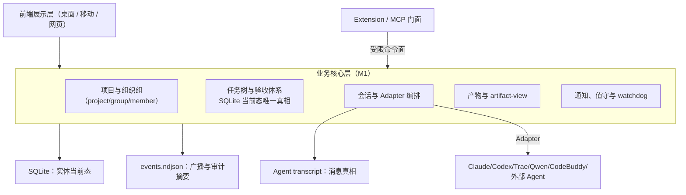

# cc-deck V2 系统设计 0.9 —— Agent 无关编排层

> 版本链：0.8（2026-09-23，三轮复审）→ **0.9（2026-10-05，双评合流 + 用户拍板）**。本版吸收 `/tmp/leader-v2-review.md`、`/tmp/pm-v2-review.md`、`/tmp/v2-merge-brief.md`、`/tmp/lane-merge-brief.md`，并固化 O1-O5、四新表、artifact 键 A、M1 四步与泳道命名。状态：0.9 定稿候选，待 Leader 核验后入库。
> 用户拍板：005 词表冻结先行；artifact 主键采用 `(source_id, normalized_path)`；M1-0→M1-1→M1-2→M1-3；泳道为「待认领/进行中/待审查/待收单/完成」；空泳道由 `workflow_profile` 门控；`review_required/review_status` 字段化。
> 红线继承：五态机、用户在环闸口、认领原子性、消息真相在 transcript、relay 零依赖单进程、内部数据不入开源仓库。

## 一、定位与战略

cc-deck 是 Agent 无关的多 Agent 编排控制面。核心只依赖 `AgentAdapter` 六能力契约，不把 Claude Code 的 TaskList、hooks 等实现细节写进核心接口。

- **Adapter 基准**：`ClaudeCodeAdapter` 是契约基准实现；Claude/Codex/Trae/Qwen Code/CodeBuddy 等按 006 能力矩阵增量接入，新增引擎不改编排核心。
- **引擎矩阵**：`SessionEngine` 六枚举为 `claude|codex|trae|qwen-code|codebuddy|zcode`；Registry 当前注册 Trae、Qwen Code、CodeBuddy；Claude/Codex 走专用路径；ZCode 明确 `unsupported/fail-closed`，不可伪造能力。schema 统一记录 `engine/provider/model/preflight_state/capabilities`。
- **三种接入面**：宿主模式由 relay spawn/管理 Agent；MCP 门面是外部 Agent 的独立侧门；Extension 是控制面扩展面。`verdict.self` 永不向 MCP 门面开放。
- **组织三轴**：`business_role[team_pm|global_leader|review_pm|worker]`、`command_role[owner|operator|viewer]`、`task_participation[assignee|reviewer|observer]` 分列，互不替代。历史 `actor:"leader"` 仅兼容读取映射为 `team_pm`。

## 二、总体分层

SQLite 只回答当前实体态；`events.ndjson` 只回答广播与审计，mutation 必须先库后事件，事件携实体引用/增量而非全量状态；消息正文只在 transcript。三端 SNAPSHOT 仍是权威投影，不是第二数据库。

## 三、AgentAdapter 契约

六能力为生命周期 spawn/resume/stop、事件归一、文本输入、审批、历史读取、产物/任务观测。每个 Adapter 必须声明能力位、外部身份格式、心跳物理来源、preflight 结果与降级方式。

- Claude：SDK session id 作为 `external_sid`，保留当前 resume 语义。
- Codex：thread id/JSONL 事件流，preflight 检查 CLI、凭证、版本、JSONL 能力；缺能力 fail-closed。
- Trae/Qwen Code/CodeBuddy：Registry 注册，按 JSONL/CLI 能力报告；通用 JSONL 仅作受限兜底。
- ZCode：枚举可读但未注册，创建/派单返回显式 unsupported ACK。
- 统一外部身份为 `(engine, external_sid, external_kind)`；不再用 `claude_sid` 作为全局 schema 主词。桥接 `ext-` 前缀拆为 `agent_type + external_sid`。

## 四、项目、组织组与成员

项目是代码/目录归属；组织组是编制、任务板、派单与值守运行单元。旧 `ProjectGroup` 一次迁移为 `project + group` 两层，不再维护 `team + team_member` 的平行模型。

### 4.1 member（全局锚表）

`member(id, stable_identity, display_name, business_role, command_role, task_participation, engine, provider, model, external_sid, joined_at, retired_at, last_heartbeat_at, last_business_log_at, status, archive_json, ts)`。

成员跨组复用；退休不删除，`retired_at` 与 archive 保留历史身份。当前活跃 session 是 assignment，不是成员本体；timeline join 规则为 live assignment first、member archive fallback。

### 4.2 group（项目组表）

`group(id, project_id→, name, anchor_dir, status[pending|active|parked|archived], tier[轻立项|正经立项], single_card, headcount_json, role_defaults_json, hold_suggested_at?, archive_note?, workflow_profile[engineering|delivery|custom], created_at, updated_at)`。

`headcount_json` 是编制快照，不替代 member；`role_defaults_json` 存角色默认 engine/model/provider；`pending` 由确认卡收口后才能 active，parked 冻结任务板但保留责任，archived 只读。

## 五、数据层总纲与迁移

- **SQLite（better-sqlite3）**：`~/.cc-deck/data/cc-deck.db`，WAL、外键、CHECK、明确索引；实体当前态唯一真相。
- **双轨职责**：库先写，事件后发；`events.ndjson` 保留广播/审计摘要，历史不承担实体回放真相；transcript 保留消息正文。
- **StoragePort**：所有新持久化统一经 StoragePort，业务层不得直接新增 `*.json` 事实源。旧 JSON 作为迁移输入与一个版本周期的只读回退。
- **迁移策略**：schema-first → snapshot import → 有界双读 → DB-only。无长期双写；迁移前逐文件 realpath/ID 归一并出损失清单。
- **导入源**：`org.json/org-config.json`、`projects.json`、`boards/*.json`（含 beads）、`confirms.json`、`dispatch-log.ndjson` 五类组织业务源；另导入 `acceptances/*.json`、`*.results.json`、`deliverables.json` 作为验收/产物 sidecar。`events.ndjson` 只读保留。
- **过渡前置**：修复事件分桶/seq max/心跳 transient；迁移后下线 history reducer，session 运行态由表承接；所有迁移均有重启、断电、幂等、旧客户端 fixture。

## 六、表设计（逐表定案）

通用约定：自增主键或稳定业务键；`created_at/updated_at`；外键与 CHECK；制度记忆实体用 `deleted_at`，投影可物理清理；高频查询建索引。以下不再使用“其余六表无争议”标签。

### 6.1 task（任务当前态）

`task(id, project_id→, group_id→, session_id→当前归属会话, parent_task_id?, origin[system|agent_native], external_sid?, external_task_file_id?, task_ref UNIQUE, title, description, scope_json, handoff, assignee_id→member?, branch?, artifact_id?, depends_on_json, gate_reason?, gate_opened_at?, review_required, review_status[pending|passed|not_required], workflow_profile?, deleted_at?, status, ts)`。

- `status[backlog|claimed|submitted|ready_to_install|done]` 五态；`blocked` 是派生态：`gate_reason` 在场即阻塞，不增加第六个 status。
- `depends_on_json` 承接 beads 依赖；坏引用按未就绪；`gate` 只能由用户/授权命令显式清除；`lessons` 不塞 task，落独立 lesson 表。
- `parent_task_id` 承接修复卡；父卡状态读时聚合，不落第二状态。`session_id` 是当前归属，会随接替迁移。

#### 6.1.1 五态与五泳道

| task status | 005 泳道 | 语义 | 门控 |
|---|---|---|---|
| `backlog` | 待认领 | 无当前承接者，可派/可领 | 全部 workflow |
| `claimed` | 进行中 | 已认领/执行/等待回写 | 全部 workflow |
| `submitted` | 待审查 | 自验提交，等 PM/reviewer 审查 | `review_required` 决定是否显示待审查徽标 |
| `ready_to_install` | 待收单 | 产物/验收单已就绪，等用户确认收单 | 仅 `workflow_profile=delivery` 或显式交付流程；有卡自动显现 |
| `done` | 完成 | 用户收单/终态闭环 | 全部 workflow |

“待审查”是 submitted 的正式泳道，不新增 task 状态；`review_status` 只控制阶段/动作，reject 必须带 reason 并回 claimed。`待收单`取代“待装机”，发版项目可在卡内显示“待收单 · 待装机”。桌面启用泳道可显示空态 0；禁用泳道不占位；手机只显示非空分组。计数只数实际卡，不数 dispatch/审查/验收事件；同卡不得出现在两个泳道。

### 6.2 acceptance_item / acceptance_result / acceptance_sheet

`acceptance_item(id, task_id→叶子, seq, content, self_verdict?, self_evidence?, by_session?, derived_from_item_id?)`；活 self 状态与历史判定分离。

`acceptance_result(id, sheet_id→, item_id→, self_verdict, self_evidence, by_session, user_verdict, ts, UNIQUE(sheet_id,item_id))`；用户终验唯一由用户凭证写入，closed 后改判只改 result 并按 fail 生成修复卡。

`acceptance_sheet(id, project_id→, title, version, issued_by_session, status[open|filled|closed], task_ids_json, snapshot_json, sheet_key?, created_at, updated_at)`；id 仅路由，fill/close 需用户端凭证。旧 rows 自由文本不猜 task 外键：迁移到 snapshot-only 或 `task_id=NULL` 兼容行。

### 6.3 session

`session(id, project_id→, group_id?, external_sid, external_kind, engine, provider, model, session_cwd, is_team_session, parent_sid?, anchor_project_id?, title_override?, pinned_at?, todo_hidden_json?, runtime_state_json?, spawn_record_json?, lifecycle_status[live|idle|working|waiting|error|done|removed], run_status[WORKING|WAITING|ERROR|DONE], worktree_path?, ts)`。

协议四态不强行扩大；`lifecycle_status` 承接重启/归档/removed，`run_status` 继续服务 005 dock 与现有客户端。消息不进表，历史通过 transcript 分页与 message-id 锚读取。

### 6.4 member / group

见 §四。`member` 是全局不可变身份/归档锚；`group.headcount_json` 是当时编制快照。不要用 per-team `team_member` 覆盖跨组退休/复活历史；业务角色、命令权限、任务参与角色三轴分列。

### 6.5 dispatch

`dispatch(id, task_id→, group_id→, tier[咨询|随手办|轻立项|正经立项|暂缓|看门狗], target_member_id?, source_session_id?, status[dispatched|running|done|failed], actor, command_id, receipt?, attempt_no, parent_dispatch_id?, created_at, updated_at)`。

同一 dispatch 的 attempt/ACK/receipt 历史 append-only，不能被 task 当前态覆盖；重投递只增加 attempt，保留失败/取消/超时证据。`tier` 只在 dispatch，避免 task/dispatch 双写。

### 6.6 lesson

`lesson(id, group_id→, text, tags_json, source_dispatch_id?, source_task_id?, created_at)`；append-only，tags AND 筛选，经验由 cc-deck 定义，不散到外部 memory。

### 6.7 org_confirm

`org_confirm(id, kind[project-create|tier-change|suggest-hold|archive|revive], group_id?, title, reason, payload_json, status[pending|approved|rejected], created_at, decided_at?, decided_by?)`。

`pending→approved/rejected` 是用户决策唯一写面；建组、档位、暂缓、归档、复活均先落确认卡。索引：`CREATE INDEX ... ON org_confirm(status) WHERE status='pending'`。Leader/PM 只能提案，不能代用户决议。

### 6.8 artifact

`artifact(source_id, normalized_path, project_id?, group_id?, session_id?, task_id?, delivery_group_key?, size?, kind[deliverable|sheet|report|file], existence_state[exists|missing|unknown], deleted_at?, created_at, updated_at, PRIMARY KEY(source_id, normalized_path))`。

文件本体仍留 artifacts 文件系统；表键采用 `(source_id, normalized_path)`，project/session/task 归因同存，解决跨源同路径碰撞、会话追责与项目聚合。`artifact-view` 以该键做 join，`delivery_group_key` 优先于前缀推断。

### 6.9 notification

结构化实体：`notification(id, project_id?, group_id?, session_id?, level[info|warn|alert], category, payload_json, read_at?, dismissed_at?, handled_at?, resolved_at?, condition_key?, created_at)`；`resolved_at` 与 read/dismiss 分离，alert 不因打开清零。

`notifications.json` 在迁移期是兼容投影；`decision-notifications.json` 保留为注入/投递审计账，记录 feed/target/attempt/result，不作为端上第二业务列表。`NOTIFICATIONS_UPDATED` 与 SNAPSHOT 只投影结构化实体，目标不能退化到任意 Leader。

### 6.10 项目与索引

`project(id, name, dir_fingerprint UNIQUE, anchor_dir, is_default, is_hidden, deleted_at?, ts)`；`group.project_id` 是项目组归属。索引覆盖 task(project,status)、task(parent_task_id)、task(external_sid,external_task_file_id)、session(external_sid)、artifact(source_id,normalized_path)、notification(unread/alert)、org_confirm(pending)。

拒绝 Message 表：消息真相在 transcript；事件只带引用和摘要，避免第二正文真相。

## 七、任务链路、命令面与两条流

所有任务/验收状态变更走 relay 命令面；Agent 通过 per-session token 调 loopback API，用户/前端使用配对凭证。`task.create/claim/release/submit/retract/reject/move`、`sheet.issue/fill/close`、`verdict.self` 组成核心命令族。

- **流①下发**：用户 `task.create` 先写 SQLite → relay 计算 tier/ready、生成 `dispatch.create` → 选择 member/engine → spawn/注入 taskRef → dispatch ACK/receipt → task/session 回写。
- **流②回写**：Agent 只能以归属凭证调用 claim/submit/verdict/receipt；relay 更新当前态、审计 dispatch attempt，再发实体引用增量。Agent 直写文件/库一律挂 `agent_native`，由对账处理。
- **orgAction 单漏斗**：保留现有 `orgAction()` 及其 `project-create + anchor` 形状。新 `COMMAND_ORG_ACTION` 由 adapter 将 canonical payload 映射到旧 shape，再由单漏斗执行；ACK 返回 `command_id/ok/data{entity_id,gid}`。不为 task/group/confirm 新建第二写入口。
- **确认红线**：`org_confirm` 的 approve/reject 只接受用户凭证；PM/薄 Leader 只能产生 pending 提案。
- **状态安全**：非法转移拒绝；done 无出边；重复 command_id/dispatch envelope 返回首次真实 ACK；所有副作用带 actor/device/command_id。

## 八、消息、历史与事件

消息正文继续留 transcript。历史使用 WS `COMMAND_HISTORY` 分块（单帧 ≤512KB），按 message-id 去重；端缓存只优化上翻，SNAPSHOT 恒权威。事件从“全量状态帧”迁移为“实体 id + changed fields”增量，先冻结注册表/schema，再同步 LAN/cloud/WAN/Expo。

重连先判 last_seq 缺口，超窗信息并入 SNAPSHOT，再用 HISTORY 补齐；断连中途杀 App、24h 重连、旧客户端忽略未知字段均为 M1-3 验收项。SESSION_HEARTBEAT 改 transient，迁移后 history reducer 不再承担当前态重建。

## 九、Watchdog、通知与值守

Watchdog 使用 relay 本地心跳 + 最后业务日志双信号，三色为干活中/滞留/失联；适配器能力不足时显式降级。自动接替只处理非厂商失联；限流/额度/厂商整体故障按策略升级用户，失联接替不回池，锚迁移到新 session。

019 值守字段在本版一次纳入：`duty_policy`（enabled、allowed_playbooks、auto_dispatch_enabled、per_action_token_budget、overnight_budget、unknown_risk）、`condition_key/revision`、`feed_generation/turn_epoch`、`waiting_reason/waiting_since`、`deferred_duty_continuation`。值守审计写独立 `duty-rounds.ndjson`，不扩 EventType。

L1 事件唤醒、回合结束 Stop-hook、L2 异常守护、L3 空转告警共用 feed 单飞/去重；全 running 无 Leader 行动位必须放行休眠。告警结构化落 notification，注入投递落 decision ledger；`resolved≠read`，离线端由 SNAPSHOT/alert 查询补发。

## 十、M1 四步与启动时序

### M1-0 契约冻结

启动顺序第一颗扣子是 **005 词表/泳道/组件契约冻结**，随后冻结 schema、ID、三轴身份、权限、Adapter capability、命令/事件单一注册表、旧端降级与迁移损失。泳道契约固定：`待认领/backlog`、`进行中/claimed`、`待审查/submitted`、`待收单/ready_to_install`、`完成/done`；`workflow_profile` 控制待收单空泳道，`review_required/review_status` 只作阶段字段。

### M1-1 SQLite 数据地基

实现 better-sqlite3/WAL/FK/CHECK/索引与 StoragePort；导入五类组织 JSON/ndjson 源及 acceptance/artifact sidecars；迁移 `depends_on/gate/lessons`，并以 `computeReady` 等价 fixture、member archive、org_confirm pending、artifact composite key、notification 双层投影验收。库先写、事件后发；旧 JSON 只读回退一个版本周期。

### M1-2 编排闭环

落地 task.create→dispatch、per-session token、归属校验、ACK/receipt/attempt、beads ready/gate/lesson、083 A/B 模式与 PM 工作台、019 值守、watchdog/接替/锚迁移、验收 sheet 事务。所有新增持久化经 StoragePort；orgAction adapter 仍是单漏斗。

### M1-3 呈现与发布闸门

实体引用增量事件、LAN/cloud/WAN SNAPSHOT parity、history 分块/message-id、005 Web/Expo/desktop 组件化合流、项目/团队/通知/全局产物中心投影；最后通过 T2/T3/V1、24h 断连/杀 App/云桥/旧 relay 与 dispatch↔ACK↔events↔receipt 对账矩阵。

执行顺序固定：`005 词表冻结 → M1-0 → M1-1 → M1-2 → M1-3`。018 已完成件可在 M1-0 前收尾，但不再添加新的文件态存储节点。

## 十一、018 过渡裁定

018 不废止，转为当前协议与三端过渡实施线：B0 parity/未知命令、R1 单写者通知、C1-C3 CLI 对账、P1 bundle、W/E UI、T2 探针均保留并收尾。B3a/B4a 等已在途件完成后作为迁移输入；自本版起新实体 durable state 不再落 boards/confirms/deliverables/notification 新 JSON，统一经 StoragePort。

005 组件化第一批可在 M1-0 与 M1-1 之间做读侧抽取，但不得先于词表/schema 契约；三端事件语义改型必须与组件化和 SNAPSHOT parity 同批验收。

## 十二、扩展体系

Extension 是控制面第三接入面；内建 acceptance/deliver/artifacts 与第三方扩展同面鉴权。命令/事件类型、schema、handler、压缩器共用单一注册表。skill/MCP/CC plugin 只出现在 Agent facet，不把生态词写入控制面契约；MCP 默认只读，连接与调用写 info 审计。

## 十三、开放问题

- O1 验收单 UI 内嵌形态；O2 手机 alert 触达形态；O3 relay history cache 是否 M1.5；O4 父卡跨团队聚合与重拆；O6 验收资源并发；O7 Extension/cc-deck-relay 最终分发批；O8 历史验收单 snapshot-only 与 `task_id=NULL` 兼容行的最终取舍；O9 MCP 写面、外部 Agent 生命周期与 artifact 脱敏；O10 项目 rail 入口；O11 限流词表与自动接替默认。
- O5 SQLite 引入时机已由用户拍板并在本版落为 M1-1，不再是开放问题。

## 附录：决策日志

- **D1（0.2 修订）五态机与验收闭环的衔接**：出包+出单（agent 侧）→ ready_to_install，alert 此刻触发；收单 closed（**用户动作**）全过 → done。「永不自动 done」的自动 = 无用户动作的流转——收单即装机确认闸口，全 AI 代验也须一键收单；与 v0 #125/#138 实跑语义对齐。**被拒**：回填全过后才进 ready_to_install（双闸口冗余 + 就绪待装机语义反转，琥珀通知时点错位）；四态简化（抹掉 claimed/submitted）；item 全过无用户动作自动 done
- **D2 拒 Message 表**：第二消息真相。历史需求由查询管道 + 两层缓存承担
- **D3 拒 HTTP 头标记**：spawn 通道无头；payload taskRef + env 注入已覆盖
- **D4 验收两层判定取代「CC 无权改验收」**：防篡改边界精确化为「agent 写不进 user_verdict 列」；自验层合法化（用户自验优先准则 + 单/团队两模式策略位）
- **D5 拒「online」三色命名**：09-18 教训心跳≠在干活；绿=日志在流（干活中）
- **D6 MCP 从串行层改侧门**：前端直连业务核心；MCP 是外部 Agent 接入的第二通道
- **D7 拒多面板并行（M1）**：与 v6 导航地基单焦点冲突，降 M2 候选
- **D8（新增；0.7 被 D13 精确化，0.8 再精确写者）判定落 acceptance_result 行表**：verdict 挂 item 活定义列会被多轮 sheet 覆盖、重提无落点、审计断链；v0 results.json 的按单历史证明判定天然是 (sheet × item) 维度。**0.8 精确**：被拒的是**判定记录**挂 item；活工作态列合法（当前值非历史）且**写者限定=卡归属者**（D15）
- **D9（新增）历史锚 = (sid, message-id)**：transcript 无 seq，(sid,seq) 锚跨数据源衔接不上，压缩裁尾后失效；两源按消息 id 去重归一
- **D10（新增）板写单命令面**：一切状态变更经 relay API（agent 走 loopback，用户/前端同面），relay 单线程 = 原子性来源；被拒 Agent 直写库（多写者破坏单写者纪律）。origin 判定随之精确：经命令面 = system，对账发现的自建 = agent_native
- **D11（0.7；0.8 指代精确化）直播侧 LogEntry.id 换源为 message.id**：D9 锚的前提修正——工程复审 H1 坐实现状两路径直播 id 均为 relay 合成（`t${BOOT}-${seq}` / `xstream-${BOOT}-${n}`），与 getHistory 返回的 transcript id 字面永不相等，按 id 去重链路第一天即失效。**0.8**：直播侧唯一可换源的是 **message.id（API 消息 id）**——顶层 uuid SDK 不带（本机 21285 行实测 message.id 空值率 0，换源前提成立）；user 消息 message.id=None，直播回显不参与去重；同 id 多行合并展示；工具条目并入所属消息块或 `tool-` 派生锚（M1③ 定案）；合成 id 仅作 fallback
- **D12（0.7）session 表承接文件态与运行态全景**：§五 文件态清单 ≥12 处逐项落位（title_override?/pinned_at?/parent_sid?/todo_hidden_json?/spawn_record_json? 等），运行态（usage/水位/stats/todos/subagents/cron/pending_inputs/remote_mode + 终态 done_reason/duration_ms/last_error）落 `runtime_state_json?`——这是回放路径下线（前置必改④）兜底成立的前提；#72 水位还原、#82/#52 矫正状态机随迁移脚本进 M1① 验收点。写放大实测不劣于现状（0.8：emitUpdated 2s 节流同点写库，WAL）
- **D13（0.7；0.8 补边界）自验两段式**：item 活工作态列（self_verdict/self_evidence/by_session，随 verdict.self 更新）+ sheet.issue 事务内搬运生成 result 首行。**0.8 补**：活列**搬运后不清空**（活列答「现在」、result 首行答「出单时点」，展示层卡视图取活列/单据视图取 result）；**issue 全动作单事务**（sheet 行+snapshot+result 搬运+卡翻转+alert 插入，防中间态广播）——修复「verdict.self 早于 sheet 存在时无处落」的空洞（S1-1）
- **D14（0.7；0.8 收口）修复卡细则**：收单 fail 行 → 原卡**维持 ready_to_install**（不回 claimed——修复卡是原卡子卡，父卡=子卡聚合派生，回 claimed 会让两条派生腿打架）；「修复中」= 派生展示态非第六态（原卡同时移出「就绪待装机」组）；修复卡 origin=system 新增判定路径（relay 编排副作用）；**克隆范围=仅 fail 行 item**（derived_from_item_id 溯源；fail 原因写修复卡 description 首行）；**默认 assignee=原卡归属者**（上下文最全；生成即通知归属会话）；**收口（0.8，产品 F2/一致性 P1-4 三重命中）**：sheet 批=卡集合（原卡+未 done 修复卡同单）、sheet.close 全过**作用域=批内全部卡**一并 done——原卡不需要自己的单，「全部 done 才收团」不再死锁；fail 原 item 已有终验不再入下轮快照（重验由克隆 item 同批承载，防两行）；**closed 后改判**：仅修 result + fail 改判触发修复卡（用户动作=改判），卡态不回转
- **D15（0.8）单会话验收裁定与判定效力**：**不设 verifier.self 列**——效力来自出单动作。团队：user_verdict pass，或（活列 self=pass 且出单由非归属者完成）；单会话：user_verdict pass，或（agent self=pass 且用户一键收单）——agent 兼任验收位，防自验自判的替代闸门=D1 收单闸口。未测判据统一：**无 user_verdict 且无经出单认可的 self pass**。被拒：verifier.self 独立列（活列双写者互覆盖，产品 F3）；「worker self 一律不参与」字面（单会话全 AI 代验单永远走不进 done，一致性 P0-1）
- **D16（0.8）命令面身份与凭证模型**：agent = spawn 签发 per-session token（env 注入）；用户 = 端配对凭证；**归属校验**（release/submit/retract/verdict.self 仅卡归属会话）；**sheet 凭证分离**：id 仅路由，fill/close 须用户端凭证——v0「id 即凭证」作废（单会话出单者=agent 持有 id，否则 issue+fill+close 一手包办打穿 D1，产品 F5）；60s/10 次限流保留。过渡注记：现状 deliver 脚本 agent 直读 LAN token，M1② 切换

- **D17（0.9，2026-10-05）**：双评合流与用户拍板。O1 组织域改为 `member + group`，O2 改为 Claude 基准+多适配器，O3 作废“其余六表无争议”，O4 artifact 主键采用 `(source_id, normalized_path)` 并同时保存 project/session/task 归因，O5 采用 schema-first+import+有界双读；新增 lesson/dispatch/group/org_confirm 四表；task 落 depends_on/gate、blocked 为派生态；notification 采用结构化实体+注入审计双层；019 值守字段一次纳入；新 durable state 统一 StoragePort；M1 固定四步与启动顺序 `005 词表冻结→M1-0→M1-1→M1-2→M1-3`；泳道固定「待认领/进行中/待审查/待收单/完成」，workflow_profile 门控空泳道，review_required/review_status 字段化。

- **D18（M1-0 冻结，2026-10-05 用户拍板「关键代拍板的都按推荐」）**：①三态→五态就近映射（todo→backlog/doing→claimed/done→done），一次性迁移不保留旧态；submitted 仅由 review_required=1 的完成候选生成 ②事件粒度先复用 PROJECTS_UPDATED/BOARD_UPDATED 扩 payload（entity_refs+delta，旧字段保留旧端天然兼容），五个细事件 M1-3 需要时再注册 ③九条技术裁定生效：半注册 2 命令补 LAN/cloud 白名单、artifact unknown 禁下载禁预览、多 Leader 过渡 last-writer、双读截止=M1-2 结束、member stable_identity=`<orgDir>@<role>@<engine>`、dispatch 一行状态机、notification_client_state 独立表、duty-rounds 独立 ndjson 不入库、import checkpoint 幂等+归因缺失记 NULL 不回填。**契约正文=`docs/v2-m10-freeze.md`**（15 表 DDL 定案+35 命令/26 事件 registry 终稿+import loss list 15 项+M1-1 八批拆解 A→B→(C-F 并行)→G→H）；勘察基线=`docs/reviews/2026-10-05-pm-m10-inventory.md`。M1-0 完成，M1-1 可派单。
